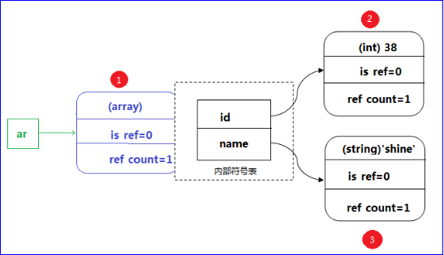
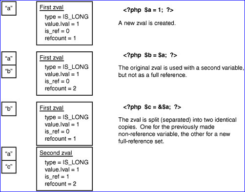
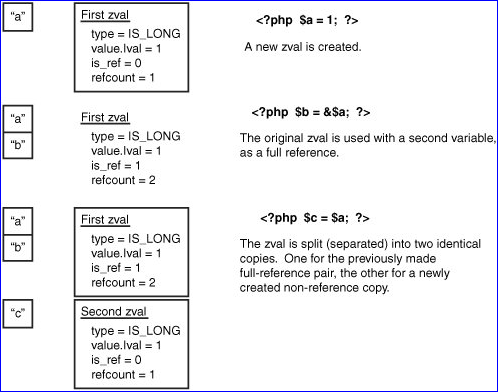

## foreach的引用赋值

我们先来做一道试题，进而思考一下foreach的引用赋值。

题目：请写出以下php语句执行输出的结果：

```php
<?php
    $arr = [1,2,3];  
    foreach($arr as &$value){
    	# code...
    }
    foreach($arr as $value){
    	# code...
    }
    print_r($arr);
```
	
答案：  
    Array ( [0] => 1 [1] => 2 [2] => 2 ) 

怎么样？这样的输出结果是如你所愿呢？还是出乎了意料呢？

***

那下面我们来分析一下为何会有这样的结果。如下：

```php
<?php
    $arr = [1,2,3];  
    foreach($arr as &$value){
    	var_dump($arr);
        echo "<br/>";
    }
    echo "<br />";
    foreach($arr as $value){
    	var_dump($arr);
        echo "<br/>";
    }
```
```
输出：
    array(3) { [0]=> &int(1) [1]=> int(2) [2]=> int(3) } 
    array(3) { [0]=> int(1) [1]=> &int(2) [2]=> int(3) } 
    array(3) { [0]=> int(1) [1]=> int(2) [2]=> &int(3) } 

    array(3) { [0]=> int(1) [1]=> int(2) [2]=> &int(1) } 
    array(3) { [0]=> int(1) [1]=> int(2) [2]=> &int(2) } 
    array(3) { [0]=> int(1) [1]=> int(2) [2]=> &int(2) } 
```
当我们在两个foreach语句的循环体中增加了`var_dump()`时就很容易看出其中引用赋值对foreach语句的执行带来的变化。  

原因分析：foreach循环遍历时，会将数组的键和值分别赋值给变量`$key`（上述未定义）和`$value`，相当于`$value = $arr[$key]`。如果是`&$value`时，则`$value = &$arr[$key]`。故第一个foreach循环时，通过`var_dump()`打印会看到三次分别再`$arr[0],$arr[1],$arr[2]`处存在引用赋值。而第二个foreach循环时，因`$arr[2]`的地址指向和`$value`是同一内存空间，所以会看到第二次foreach循环时`$arr[2]`的值会分别是`1,2,3`。

（注：foreach循环执行完毕后并不会释放`$key`和`$value`，所以在你的代码中foreach执行完毕后请谨慎时候`$key`和`$value`，尤其是引用赋值。）

***

不知道上述是否能让你有所收获，结尾我们还有一道题，来看一下吧。

题目：请写出以下php语句执行输出结果：  
```php
<?php
    $arr = [1,2,3];  
    foreach($arr as $value){
    	unset($value);
    }
    var_dump($arr);
    
    foreach($arr as &$value){
    	unset($value);
    }
    var_dump($arr);
```
```
输出：
    array(3) { [0]=> int(1) [1]=> int(2) [2]=> int(3) } 
    array(3) { [0]=> int(1) [1]=> int(2) [2]=> int(3) } 
```

## 由foreach引发的关于PHP底层变量存储的思考

> 本文首发于 [zval _ 引用计数 _ 变量分离 _ 写时拷贝](https://segmentfault.com/a/1190000004340427)

经过上文中的两个题目后不知道你有没有对foreach的机制了解的更清楚一点了呢？不如我们再来看一个题目：

```php
<?php
    $arr = [1,2,3];  
    foreach($arr as $value){
        if($value <= 2){
            $arr[] = $value * 10;
        }
        echo $value . "<br />";
    }
    var_dump($arr);
    echo "<br />";
    echo "<br />";
    $arr = [1,2,3];
    foreach($arr as &$value){
        if($value <= 2){
            $arr[] = $value * 10;
        }
        echo $value . "<br />";
    }
    var_dump($arr);
```
```
输出：
    1
    2
    3
    array(5) { [0]=> int(1) [1]=> int(2) [2]=> int(3) [3]=> int(10) [4]=> int(20) } 

    1
    2
    3
    10
    20
    array(5) { [0]=> int(1) [1]=> int(2) [2]=> int(3) [3]=> int(10) [4]=> &int(20) } 
```

看到这个题目有没有清楚一点呢？当我们对数据循环时相当于先对数据进行了拷贝，在数组循环体中如果要改变原数组的值或者往原数组中插入新的元素都需要对`$arr`进行赋值操作，且新插入的元素不会被循环。而foreach引用赋值时，修改原数组的值只需要对相对应的元素的`$value`值进行修改就好，且新插入的元素会被循环。这究竟是为什么呢？为什么会是这样一种机制呢？下面我们来了解一下PHP的zval存储结构。

### PHP变量的存储结构

在PHP中，所有的变量都是用一个结构zval结构来保存的，在Zend/zend.h中可以看到zval的定义：

```c
struct _zval_struct {
   /* Variable information */
   zvalue_value value;      /* value */
   zend_uint refcount;
   zend_uchar type;         /* active type */
   zend_uchat is_ref; 
};
```

zval结构包括：
1. value —— 值，是真正保存数据的关键部分，定义为一个联合体(union)
2. type —— 用来储存变量的类型 
3. is_ref —— 下面介绍
4. refcount —— 下面介绍

声明一个变量
$addr="北京";
PHP内部都是使用zval来表示变量的，那对于上面的脚本，ZE是如何把addr和内部的zval结构联系起来的呢？
变量都是有名字的（本例中变量名为addr）
而zval中并没有相应的字段来体现变量名。PHP内部肯定有一个机制，来实现变量名到zval的映射
在PHP中，所有的变量都会存储在一个数组中（确切的说是symbol_table）
当你创建一个变量的时候，PHP会为这个变量分配一个zval，填入相应的信息，然后将这个变量的名字指向这个zval的指针填入一个数组中。当你获取这个变量的时候，PHP会通过查找这个数组，取得对应的zval

注意：数组和对象这类复合类型在生成zval时，会为每个单元生成一个zval

  

### zval和变量的内存地址有什么关系呢？

定义一个变量会开辟一块内存，这块内存好比一个盒子，盒子里放了zval，zval里保存了变量的相关信息，需要开辟多大的内存，是由zval所占空间大小决定的。zval是内存对象，垃圾回收的时候会把zval和内存地址（盒子）分别释放掉。

### 引用计数

下面我们来说一下zval中的refcount，我们知道PHP是一个长时间运行的服务器端脚本。那么对于它来说，效率和资源占用率是一个很重要的衡量标准，也就是说，PHP必须尽量减少内存占用率。我们来看下面代码：

```php
<?php 
$var = "laruence";
$var_dup = $var;
unset($var);
?>
```

第一行代码创建了一个字符串变量，申请了一个大小为9字节的内存，保存了字符串“laruence”和一个NULL(\0)的结尾。
第二行定义了一个新的字符串变量，并将变量var的值“复制”给这个新的变量。
第三行unset了变量var。

这样的代码是很常见的，如果PHP对于每一个变量赋值都重新分配内存，copy数据的话，那么上面的这段代码就要申请18个字节的内存空间，为了申请新的内存，还需要cpu执行某些计算，这当然会加重cpu的负载。
而我们也很容易看出来，上面的代码其实根本没有必要申请两份空间，当第三句执行后，$var被释放了，我们刚才的设想（申请18个字节内存空间）突然变的很滑稽，这次复制显得好多余。如果早知道$var不用了，直接让$var_dup用$var的内存不就行了，还复制干嘛？如果你觉得9个字节没什么，那设想下如果$var是个10M的文件内容，或者20M，是不是我们的计算机资源消耗的有点冤枉呢？
所以PHP开发者肯定不会犯这么严重的错误，否则PHP也不会成为最伟大的语音。

刚才说了，PHP中的变量是用一个存储在symbol_table中的符号名，对应一个zval来实现的，比如对于上面的第一行代码，会在symbol_table中存储一个值“var”，对应的有一个指针指向一个zval结构，变量值“laruence”保存在这个zval中，所以不难想象，对于上面的代码来说，我们完全可以让“var”和“var_dup”对应的指针都指向同一个zval就可以了。

PHP也是这样做的，这个时候就需要介绍一下zval结构中的refcount字段了。
refcount，引用计数，记录了当前的zval被引用的次数（这里的引用并不是真正的PHP的& ，而是有几个变量指向它）。
比如对于代码：

```php
<?php
$var = 1;
$var_dup = $var;
```

第一行，创建了一个整形变量，变量值是1。 此时保存整形1的这个zval的refcount为1。
第二行，创建了一个新的整形变量（通过赋值的方式），变量也指向刚才创建的zval，并将这个zval的refcount加1，此时这个zval的refcount为2。所以，这个时候（通过值传递的方式赋值给别的变量），并没有产生新的zval，两个变量指向同一zval，通过一个计数器来共用zval及内存地址，以达到节省内存空间的目的。
当一个变量被第一次创建的时候，它对应的zval结构的refcount的值会被初始化为1，因为只有这一个变量在用它。但是当你把这个变量赋值给别的变量时，refcount属性便会加1变成2，因为现在有两个变量在用这个zval结构了。

PHP提供了一个debug_zval_dump()函数可以帮助我们了解这个过程，但是debug_zval_dump()函数不太好用，输出的跟实际情况有点不符。幸运的是PHP的xdebug扩展提供了xdebug_debug_zval()函数，看下面两个例子：

```php
<?php
$var = 1;
xdebug_debug_zval('var');
$var_dup = $var;
xdebug_debug_zval('var_dup');
```

```
输出：
var:
(refcount=1, is_ref=0),int 1
var_dup:
(refcount=2, is_ref=0),int 1
```

```php
<?php
$a = 1;
$b = $a;
$c = $b;
$d = $c;
xdebug_debug_zval($a);
```
```
输出：
a:
(refcount=4, is_ref=0),int 1
```

又如下面代码，当我们执行`unset($var)`时会删除符号表里的`$var`的信息，准备清理其对应的zval及内存空间，这时发现$var对应的zval结构的refcount值是2，也就是说，还有另外一个变量在一起用着这个zval，所以`unset($var)`时只需把这个zval的refcount减去1就行了。

```php
$var = 'dmxy';
$var_dup = $var;
xdebug_debug_zval('var');
unset($var);
xdebug_debug_zval('var_dup');
```
```
输出：
var:
(refcount=2, is_ref=0),string 'dmxy' (length=4)
var_dup:
(refcount=1, is_ref=0),string 'dmxy' (length=4)
```

到这儿我们就明白了PHP变量存储zval结构中refcount的作用即：引用计数。

### 写时拷贝（copy on write）

我们来看下面一段代码：
```php
<?php
$var = 'dmxy';
$var_dup = $var;
xdebug_debug_zval('var');
$var = 1;
xdebug_debug_zval('var');
xdebug_debug_zval('var_dup');
```
```
输出：
var:
(refcount=2, is_ref=0),string 'dmxy' (length=4)
var:
(refcount=1, is_ref=0),int 1
var_dup:
(refcount=1, is_ref=0),string 'dmxy' (length=4)
```

这段代码是PHP很常见的一种赋值操作。我们上面了解到当代码执行到第二行的时候变量`$var`和`$var_dup`实际上都是指向了同一内存地址。那如果此时在执行第三行在zval结构上又是怎样实现的呢？  

这里我们就要了解一下PHP的写时拷贝（copy on write）机制：  
PHP在修改一个变量以前，会首先查看这个变量的refcount，如果refcount大于1，PHP就会执行一个分离的过程（在Zend引擎中，分离是破坏一个引用对的过程）。对于上面的代码，当执行到第三行的时候，PHP发现`$var`想要改变，但它指向的zval的refcount大于1，那么PHP就会复制一个新的zval出来，改变其值，将改变的变量指向新的zval，并将原zval的refcount减1，并修改symbol_table里该变量的指针。这个机制就是所谓的copy on write（写时复制，这里的写包括普通变量的修改及数组对象里的增加、删除单元操作）。

### 写时改变（change on write）

现在我们再来看一下zval结构中的is_ref。通过了解is_ref你会发现上面说的到写时复制不是那么的严谨。具体我们下面会说到：

现在我们通过了解zval中的refcount知道了当我们复制一个变量时并不是真的进行了复制，而是通过指向相同的zval结构开节约内存的开销。看到这儿我们会有一个疑惑，两个变量指向同一内存地址这不是PHP的引用（&）吗？这不是冲突了吗？那PHP的引用（&）又是怎么实现的呢？我们来看下面代码：

```php
<?php
$var = 'dmxy';
$var_dup = &$var;
xdebug_debug_zval('var');
$var_dup = 1;
xdebug_debug_zval('var');
```
```
输出：
var:
(refcount=2, is_ref=1),string 'dmxy' (length=4)
var:
(refcount=2, is_ref=1),int 1
```

这段代码结束后我们知道变量`$var`也会被修改为1，这个过程即为：写时改变（change on write）。  
那么ZE是怎么知道，这次赋值时不需要复制呢？  
这个时候就要用到zval中的is_ref字段了：  
对于上面的代码，当第二行执行以后，`$var`所代表的zval的refcount变为2，并且设置is_ref为1。到第三行的时候，PHP先检查`$var_dup`对应的zval的is_ref字段（is_ref 表示该zval是否被&引用，仅表示真或假，就像开关的开与关一样，zval的初始化情况下为0，即非引用），如果为1，则不需要拷贝，直接更改，更改共享的zval实际上也间接更改了$var的值，因为引擎想所有的引用变量都看到这一改变。


### 写时分离

我们再来看下面这段代码：
```php
<?php 
$var = 'dmxy';
$var_dup = $var;
xdebug_debug_zval('var_dup');
xdebug_debug_zval('var');
$var_ref = &$var;
xdebug_debug_zval('var_dup');
xdebug_debug_zval('var');
xdebug_debug_zval('var_ref');
```
```
输出：
var_dup:
(refcount=2, is_ref=0),string 'dmxy' (length=4)
var:
(refcount=2, is_ref=0),string 'dmxy' (length=4)

var_dup:
(refcount=1, is_ref=0),string 'dmxy' (length=4)
var:
(refcount=2, is_ref=1),string 'dmxy' (length=4)
var_ref:
(refcount=2, is_ref=1),string 'dmxy' (length=4)
```

下面我们根据输出来分析一下PHP变量在上面这种情况下是怎么实现的：  
当代码执行到第二行时，`$var`和`$var_dup`将指向同一zval结构，refcount为2。  
当执行第三行的时候，PHP发现要操作的zval的refcount大于1，则PHP会执行Separation（也就是说php将一个zval的is_ref从0设为1 之前，会看该zval的refcount，如果refcount>1，则会分离）, 将`$var_dup`分离出去，并将`$var`和`$var_ref`做change on write关联。也就是，refcount=2, is_ref=1;  
所以内存会给变量`$var_dup`分配出一个新的zval，类型与值同`$var`和`$var_ref`指向的zval一样，是新分配出来的，尽管他们拥有同样的值，但是必须通过两个zval来实现。试想一下，如果三者指向同一个zval的话，改边`$var_dup`的值，那么`$var`和`$var_ref` 也会受到影响，这样就乱套了。  
图解：



又如下面代码：

```php
<?php 
$a = 1;
$b = &$a;
$c = $a;
xdebug_debug_zval('a');
xdebug_debug_zval('b');
xdebug_debug_zval('c');
```



### 垃圾回收概述

PHP的垃圾回收也是与refcount和is_ref这两个字段有关（garbage collection简称gc），refcount表示当前有几个变量引用此zval，而is_ref表示当前zval是否被按引用引用。当一个内存对象建立时计数器初始化为1（此时总是有一个变量引用此对象），以后每有一个新变量引用此内存对象，则计数器加1，而每当减少一个引用此内存对象的变量则计数器减1，任何关联到某个zval的变量离开它的作用域（比如：函数执行结束），或者把变量unset掉，refcount也会减1。当垃圾回收机制运作的时候，将所有计数器为0的内存对象销毁并回收其占用的内存。而PHP中内存对象就是zval，计数器就是refcount。  


至此我们关于PHP变量存储的原理已经说完了。其中如有那些错误希望大神们指正，以便我们能更清楚的了解PHP底层变量存储原理。对于PHP底层了解的越清楚越有利于我们写出高效，坚固，优美的代码。
