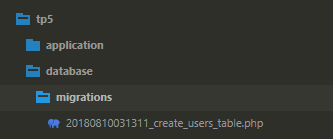
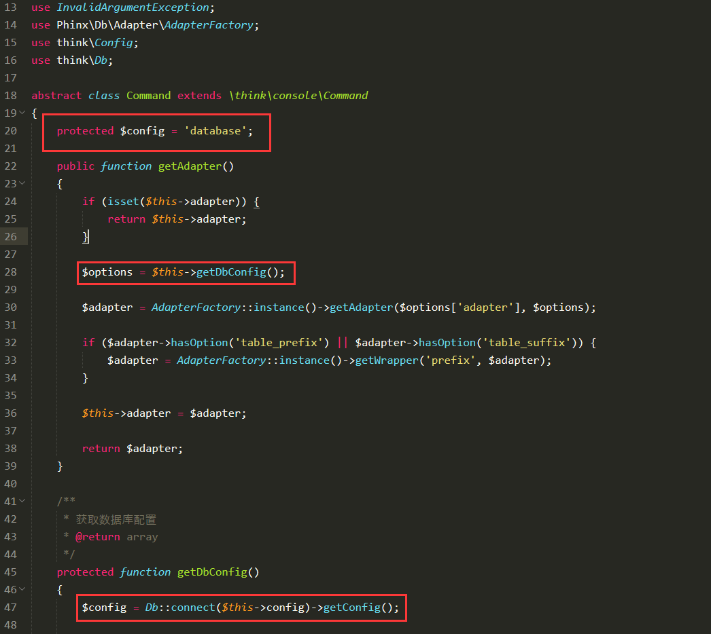
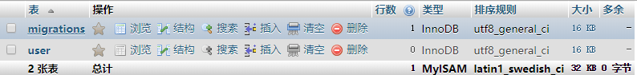

### ThinkPHP5数据库迁移工具think-migration的使用

为了项目上线方便，想到了laravel框架中的数据库迁移工具Migrations，tp5下一搜索果然也有相应的封装，二话不说：  

	composer require topthink/think-migration

然后就看到了一句让人心凉的话：

	注意事项，不支持修改文件配置目录

当初项目刚开始，感觉tp5的配置文件很乱。幸而看见是可以单独定义配置文件目录的，然后既然提到这儿那后面的剧情也就显而易见了。咱也不是那种因为一句话就放弃的人，即使不支持自定义配置文件目录，那咱也得看看是因为什么，看看有没有什么尽量改动较小的实现办法。

首先说明我的ThinkPHP版本是5.0.20，composer执行完，即使知道有问题也得按手册尝试一下：

	php think migrate:create CreateUsersTable

然后就是如下的错误信息了：

	[think\exception\ThrowableError]
	Fatal error: Class 'think\facade\Env' not found


百度了一下原来是composer安装的think-migration版本太高，修改composer.json文件里的migrate的版本为^1.0，然后`composer update`，再次尝试就OK了。执行成功后会在项目根目录中增加如下内容：

  

打开文件`create_users_table.php`，内容如下：

``` php
<?php

use think\migration\Migrator;
use think\migration\db\Column;

class CreateUsersTable extends Migrator
{
    /**
     * Change Method.
     *
     * Write your reversible migrations using this method.
     *
     * More information on writing migrations is available here:
     * http://docs.phinx.org/en/latest/migrations.html#the-abstractmigration-class
     *
     * The following commands can be used in this method and Phinx will
     * automatically reverse them when rolling back:
     *
     *    createTable
     *    renameTable
     *    addColumn
     *    renameColumn
     *    addIndex
     *    addForeignKey
     *
     * Remember to call "create()" or "update()" and NOT "save()" when working
     * with the Table class.
     */
    public function change()
    {

    }
}
```

我们可以看到模版文件中有一个`change()`方法，通过了解[Phinx文档](http://docs.phinx.org/en/latest/)我们能够知道`change()`方法是不支持回滚的，所以我们可以使用下面的方法：

``` php
<?php

use think\migration\Migrator;
use think\migration\db\Column;

class CreateUsersTable extends Migrator
{
    /**
    * 建立用户表
    */
    public function up(){
        $table = $this->table('user');
        $table->addColumn('username' , 'string' , ['limit' => 30])
           ->addColumn('passwork' , 'string' , ['limit' => 32])
           ->addColumn('email' , 'string' , ['limit' => 25])
           ->addColumn('lastlogin_ip' , 'string' , ['limit' => 15])
           ->addTimestamps('create_time' , 'lastlogin_time')
           ->addColumn('status' , 'integer' , ['limit' => 1 , 'default' => 1])
           ->setId('user_id')
           ->save();
    }

    /**
    * 提供回滚的删除用户表方法
    */
    public function down(){
        $this->dropTable('user');
    }
}
```

执行`php think migrate:run`，又一次如愿的出现了错误：

	[InvalidArgumentException]
	There was a problem creating the schema table: SQLSTATE[3D000]: Invalid cat
	alog name: 1046 No database selected

根据错误信息内容我们可以知道是没有数据库被选中。再联系TP5手册中提到的不支持修改配置目录，那就不难猜到是原因了。肯定就是因为数据库配置文件修改目录改变导致无法找到。那我们就可以通过查看migretion扩展的代码来看一下migretion是如何连接数据库的呢？进入到migration扩展目录下我们首先看到四个文件`Command.php,config.php,Migrator.php,Seeder.php`，根据名字我们就能看得出来我们通过命令行执行肯定是要经过`Command.php`文件：

  

通过上图红框中的内容我们能够知道migration是通过TP框架核心类Db来实现数据库连接的，而`Db::connect()`毫无疑问肯定是读取的配置文件啊。那又是为什么配置文件目录修改以后通过CGI可以正常访问的项目，通过CLI模式就不行了呢？想到这里便有了恍然大明白的感觉，因为入口文件不同啊。打开两个入口文件一对比，这才想起来，当初修改配置文件目录的时候在入口文件中重新定义了应用配置目录：`define('CONF_PATH',__DIR__.'/../config/');`。那是不是将这个文件在CLI模式下的入口文件中也加上就好了呢？自己感觉还是挺靠谱的，赶紧添加到了根目录下的`think`文件中，并修改为：`define('CONF_PATH',__DIR__.'/config/');`。修改完成，再次尝试：

```
 == 20180810031311 CreateUsersTable: migrating
 == 20180810031311 CreateUsersTable: migrated 0.0483s

All Done. Took 0.1470s
```

幸福来得太突然了，这就是OK了啊，打开数据库：

 

成功的创建了两个数据表，至此也就搞定了我们在ThinkPHP V5.0.20下修改了配置文件目录且正常运行migration数据库迁移工具的问题。

接下来我们执行一下`php think migrate:rollback`也成功的执行了回退功能，删除了user表。

至此我们的目的已经达到，下面附上migration的几个命令

```
migrate
  migrate:breakpoint  Manage breakpoints
  migrate:create      Create a new migration
  migrate:rollback    Rollback the last or to a specific migration
  migrate:run         Migrate the database
  migrate:status      Show migration status
```

关于migration的使用方法，可以去查询[Phinx文档](http://docs.phinx.org/en/latest/)