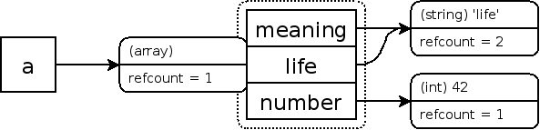
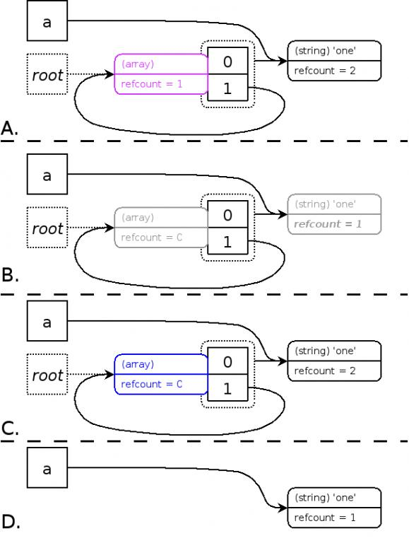
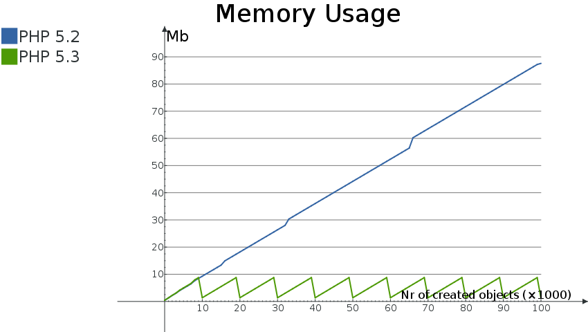

## PHP5.3之后垃圾回收机制:Zend GC详解

> 本文首发于 [PHP新的垃圾回收机制:Zend GC详解](https://blog.csdn.net/phpkernel/article/details/5734743)


### 概述

 在5.2及更早版本的PHP中，没有专门的垃圾回收器GC（Garbage Collection），引擎在判断一个变量空间是否能够被释放的时候是依据这个变量的`zval`的`refcount`的值，如果`refcount`为0，那么变量的空间可以被释放，否则就不释放，这是一种非常简单的GC实现。然而在这种简单的GC实现方案中，出现了意想不到的变量内存泄漏情况，引擎将无法回收这些内存，于是在PHP5.3中出现了新的GC，新的GC有专门的机制负责清理垃圾数据，防止内存泄漏。本文将详细的阐述PHP5.3的GC运行机制。

目前很少有详细的资料介绍新的GC，本文将是目前国内最为详细的从源码角度介绍PHP5.3中GC原理的文章。其中关于垃圾产生以及算法简介部分由作者根据手册翻译而来，当然其中融入了作者的一些个人看法。手册中相关内容：[Garbage Collection](http://www.php.net/manual/en/features.gc.php)

在介绍这个新的GC之前，读者必须先了解PHP中变量的内部存储相关知识，请先阅读 [变量的内部存储：引用和计数](https://blog.csdn.net/phpkernel/article/details/5732784) 


### 什么算垃圾

首先我们需要定义一下“垃圾”的概念，新的GC负责清理的垃圾是指变量的容器`zval`还存在，但是又没有任何变量名指向此`zval`。因此GC判断是否为垃圾的一个重要标准是有没有变量名指向变量容器`zval`。

假设我们有一段PHP代码，使用了一个临时变量`$tmp`存储了一个字符串，在处理完字符串之后，就不需要这个`$tmp`变量了，`$tmp`变量对于我们来说可以算是一个“垃圾”了，但是对于GC来说，`$tmp`其实并不是一个垃圾，`$tmp`变量对我们没有意义，但是这个变量实际还存在，`$tmp`符号依然指向它所对应的`zval`，GC会认为PHP代码中可能还会使用到此变量，所以不会将其定义为垃圾。

那么如果我们在PHP代码中使用完`$tmp`后，调用`unset`删除这个变量，那么`$tmp`是不是就成为一个垃圾了呢。很可惜，GC仍然不认为`$tmp`是一个垃圾，因为`$tmp`在`unset`之后，`refcount`减少1变成了0(这里假设没有别的变量和`$tmp`指向相同的`zval`)，这个时候GC会直接将`$tmp`对应的`zval`的内存空间释放，`$tmp`和其对应的`zval`就根本不存在了。此时的`$tmp`也不是新的GC所要对付的那种“垃圾”。那么新的GC究竟要对付什么样的垃圾呢，下面我们将生产一个这样的垃圾。  


### 顽固垃圾的产生过程

如果读者已经阅读了变量内部存储相关的内容，想必对`refcount`和`isref`这些变量内部的信息有了一定的了解。这里我们将结合手册中的一个例子来介绍垃圾的产生过程：
```php
<?php
    $a = "new string";
?>
```
在这么简单的一个代码中，`$a`变量内部存储信息为

	a: (refcount=1, is_ref=0)='new string'

当把`$a`赋值给另外一个变量的时候，`$a`对应的`zval`的`refcount`会加1
```php
<?php
    $a = "new string";
    $b = $a;
?>
```
此时`$a`和`$b`变量对应的内部存储信息为

	a,b: (refcount=2, is_ref=0)='new string'

当我们用`unset`删除`$b`变量的时候，`$b`对应的`zval`的`refcount`会减少1
```php
<?php
    $a = "new string"; 		//a: (refcount=1, is_ref=0)='new string'
    $b = $a;                //a,b: (refcount=2, is_ref=0)='new string'
	unset($b);              //a: (refcount=1, is_ref=0)='new string'
?>
```

对于普通的变量来说，这一切似乎很正常，但是在复合类型变量（数组和对象）中，会发生比较有意思的事情：
```php
<?php
	$a = array('meaning' => 'life', 'number' => 42);
?>
```
a的内部存储信息为:
```c
a: (refcount=1, is_ref=0)=array (
	'meaning' => (refcount=1, is_ref=0)='life',
	'number' => (refcount=1, is_ref=0)=42
)
```

数组变量本身`$a`在引擎内部实际上是一个哈希表，这张表中有两个`zval`项`meaning`和`number`，

所以实际上那一行代码中一共生成了3个`zval`,这3个`zval`都遵循变量的引用和计数原则，用图来表示:


下面在`$a`中添加一个元素，并将现有的一个元素的值赋给新的元素:
```php
<?php
    $a = array('meaning' => 'life', 'number' => 42);
    $a['life'] = $a['meaning'];
?>
```
那么`$a`的内部存储为:
```c
a: (refcount=1, is_ref=0)=array (
   'meaning' => (refcount=2, is_ref=0)='life',
   'number' => (refcount=1, is_ref=0)=42,
   'life' => (refcount=2, is_ref=0)='life'
)
```
其中的`meaning`元素和`life`元素之指向同一个`zval`的：



现在，如果我们试一下，将数组的引用赋值给数组中的一个元素，有意思的事情就发生了：
```php
<?php
    $a = array('one');
    $a[] = &$a;
?>
```
这样`$a`数组就有两个元素，一个索引为0，值为字符one,另外一个索引为1，为$a自身的引用，内部存储如下:
```c
a: (refcount=2, is_ref=1)=array (
   0 => (refcount=1, is_ref=0)='one',
   1 => (refcount=2, is_ref=1)=...
)
```
“...”表示1指向`$a`自身，是一个环形引用：


这个时候我们对$a进行`unset`,那么`$a`会从符号表中删除，同时`$a`指向的`zval`的`refcount`减少1
```php
<?php
    $a = array('one');
    $a[] = &$a;
    unset($a);
?>
```
那么问题也就产生了，`$a`已经不在符号表中了，用户无法再访问此变量，但是`$a`之前指向的`zval`的`refcount`变为1而不是0，因此不能被回收，这样产生了内存泄露：


这样，这么一个`zval`就成为了一个真是意义的垃圾了，新的GC要做的工作就是清理这种垃圾。


### 新的GC算法

在较新的PHP手册中有简单的介绍新的GC使用的垃圾清理算法，这个算法名为`Concurrent Cycle Collection in Reference Counted Systems` ， 这里不详细介绍此算法，根据手册中的内容来先简单的介绍一下思路：

首先我们有几个基本的准则：

1. 如果一个`zval`的`refcount`增加，那么此`zval`还在使用，不属于垃圾

2. 如果一个`zval`的`refcount`减少到0， 那么`zval`可以被释放掉，不属于垃圾

3. 如果一个`zval`的`refcount`减少之后大于0，那么此`zval`还不能被释放，此`zval`可能成为一个垃圾


只有在准则3下，GC才会把`zval`收集起来，然后通过新的算法来判断此`zval`是否为垃圾。那么如何判断这么一个变量是否为真正的垃圾呢？

简单的说，就是对此`zval`中的每个元素进行一次`refcount`减1操作，操作完成之后，如果`zval`的`refcount`=0，那么这个`zval`就是一个垃圾。这个原理咋看起来很简单，但是又不是那么容易理解，起初笔者也无法理解其含义，直到挖掘了源代码之后才算是了解。如果你现在不理解没有关系，后面会详细介绍，这里先把这算法的几个步骤描叙一下,首先引用手册中的一张图:



A：为了避免每次变量的`refcount`减少的时候都调用GC的算法进行垃圾判断，此算法会先把所有前面准则3情况下的`zval`节点放入一个节点(root)缓冲区(root buffer)，并且将这些`zval`节点标记成紫色，同时算法必须确保每一个`zval`节点在缓冲区中之出现一次。当缓冲区被节点塞满的时候，GC才开始开始对缓冲区中的`zval`节点进行垃圾判断。

B：当缓冲区满了之后，算法以深度优先对每一个节点所包含的`zval`进行减1操作，为了确保不会对同一个`zval`的`refcount`重复执行减1操作，一旦`zval`的`refcount`减1之后会将`zval`标记成灰色。需要强调的是，这个步骤中，起初节点`zval`本身不做减1操作，但是如果节点`zval`中包含的`zval`又指向了节点`zval`（环形引用），那么这个时候需要对节点`zval`进行减1操作。

C：算法再次以深度优先判断每一个节点包含的`zval`的值，如果`zval`的`refcount`等于0，那么将其标记成白色(代表垃圾)，如果`zval`的`refcount`大于0，那么将对此`zval`以及其包含的`zval`进行`refcount`加1操作，这个是对非垃圾的还原操作，同时将这些`zval`的颜色变成黑色（`zval`的默认颜色属性）

D：遍历`zval`节点，将C中标记成白色的节点`zval`释放掉。


### PHP中运用新的GC的算法

在PHP中，GC默认是开启的，你可以通过ini文件中的`zend.enable_gc`项来开启或则关闭GC。当GC开启的时候，垃圾分析算法将在节点缓冲区(roots buffer)满了之后启动。缓冲区默认可以放10,000个节点，当然你也可以通过修改Zend/zend_gc.c中的`GC_ROOT_BUFFER_MAX_ENTRIES`来改变这个数值，需要重新编译链接PHP。当GC关闭的时候，垃圾分析算法就不会运行，但是相关节点还会被放入节点缓冲区，这个时候如果缓冲区节点已经放满，那么新的节点就不会被记录下来，这些没有被记录下来的节点就永远也不会被垃圾分析算法分析。如果这些节点中有循环引用，那么有可能产生内存泄漏。之所以在GC关闭的时候还要记录这些节点，是因为简单的记录这些节点比在每次产生节点的时候判断GC是否开启更快，另外GC是可以在脚本运行中开启的，所以记录下这些节点，在代码运行的某个时候如果又开启了GC，这些节点就能被分析算法分析。当然垃圾分析算法是一个比较耗时的操作。

在PHP代码中我们可以通过`gc_enable()`和`gc_disable()`函数来开启和关闭GC，也可以通过调用`gc_collect_cycles()`在节点缓冲区未满的情况下强制执行垃圾分析算法。这样用户就可以在程序的某些部分关闭或则开启GC，也可强制进行垃圾分析算法。 


### 新的GC算法的性能

1.防止泄漏节省内存

新的GC算法的目的就是为了防止循环引用的变量引起的内存泄漏问题，在PHP中GC算法，当节点缓冲区满了之后，垃圾分析算法会启动，并且会释放掉发现的垃圾，从而回收内存，在PHP手册上给了一段代码和内存使用状况图：
```php
<?php
class Foo
{
    public $var = '3.1415962654';
}

$baseMemory = memory_get_usage();

for ( $i = 0; $i <= 100000; $i++ )
{
    $a = new Foo;
    $a->self = $a;
    if ( $i % 500 === 0 )
    {
        echo sprintf( '%8d: ', $i ), memory_get_usage() - $baseMemory, "/n";
    }
}
?>
```
这段代码的循环体中，新建了一个对象变量，并且用对象的一个成员指向了自己，这样就形成了一个循环引用，当进入下一次循环的时候，又一次给对象变量重新赋值，这样会导致之前的对象变量内存泄漏，在这个例子里面有两个变量泄漏了，一个是对象本身，另外一个是对象中的成员`self`，但是这两个变量只有对象会作为垃圾收集器的节点被放入缓冲区(因为重新赋值相当于对它进行了`unset`操作，满足前面的准则3)。在这里我们进行了100,000次循环，而GC在缓冲区中有10,000节点的时候会启动垃圾分析算法，所以这里一共会进行10次的垃圾分析算法。从图中可以清晰的看到，在5.3版本PHP中，每次GC的垃圾分析算法被触发后，内存会有一个明显的减少。而在5.2版本的PHP中，内存使用量会一直增加。
 

 

2.运行效率影响
启用了新的GC后，垃圾分析算法将是一个比较耗时的操作，手册中给了一段测试代码：
```php
<?php
class Foo
{
    public $var = '3.1415962654';
}

for ( $i = 0; $i <= 1000000; $i++ )
{
    $a = new Foo;
    $a->self = $a;
}

echo memory_get_peak_usage(), "/n";
?>
```
然后分别在GC开启和关闭的情况下执行这段代码：
```php
time php -dzend.enable_gc=0 -dmemory_limit=-1 -n example2.php
# and
time php -dzend.enable_gc=1 -dmemory_limit=-1 -n example2.php
```
最终在该机器上，第一次执行大概使用10.7秒，第二次执行大概使用11.4秒，性能大约降低7%,不过内存的使用量降低了98%,从931M降低到了10M。当然这并不是一个比较科学的测试方法，但是也能说明一定的问题。这种代码测试的是一种极端恶劣条件，实际代码中，特别是在WEB的应用中，很难出现大量循环引用，GC的分析算法的启动不会这么频繁，小规模的代码中甚至很少有机会启动GC分析算法。

总结：
当GC的垃圾分析算法执行的时候，PHP脚本的效率会受到一定的影响，但是小规模的代码一般不会有这个机会运行这个算法。如果一旦脚本中GC分析算法开始运行了，那么将花费少量的时间节省出来了大量的内存，是一件非常划算的事情。新的GC对一些长期运行的PHP脚本效果更好，比如PHP的DAEMON守护进程，或则PHP-GTK进程等等。


### 引擎内部GC的实现

前面已经介绍了新的GC的基本原理以及性能相关的内容，其中一些都是在手册中有简单介绍了，那么这里我们将从源代码的角度来分析一下PHP如何实现新的GC。

1.`zval`的变化  

在文件Zend/zend_gc.h中，重新定义了分配一个`zval`结构的宏:
```c
[cpp] view plain copy
#undef  ALLOC_ZVAL  
#define ALLOC_ZVAL(z)                                   /  
    do {                                                /  
        (z) = (zval*)emalloc(sizeof(zval_gc_info));     /  
        GC_ZVAL_INIT(z);                                /  
    } while (0)  
```
`ALLOC_ZVAL`的原始定义是在Zend/zend_alloc.h中，原始的定义只是分配一个`zval`结构的内存空间，然后在新的GC使用后，分配一个`zval`空间实际上是分配了一个`zval_gc_info`结构的空间，下面看看`zval_gc_info`结构定义:
```c
[cpp] view plain copy
typedef struct _zval_gc_info {  
    zval z;  
    union {  
        gc_root_buffer       *buffered;  
        struct _zval_gc_info *next;  
    } u;  
} zval_gc_info;  
```
`zval_gc_info`这个结构的第一个成员就是一个`zval`结构，第二个成员是一个联合体`u`，是一个指向`gc_root_buffer`的指针和一个指向`_zval_gc_info`的指针。  第一个成员为`zval`结构，这就保证了对`zval_gc_info`类型指针做类型转换后和`zval`等价。在`ALLOC_ZVAL`宏中，分配了一个`zval_gc_info`的空间后，是将空间的指针转换成了`(zval*)`。这样就相当于分配了一个`zval`的空间。然后`GC_ZVAL_INIT`宏会把`zval_gc_info`中的成员u的buffered字段设置成`NULL`:
```c
[cpp] view plain copy
#define GC_ZVAL_INIT(z) /  
    ((zval_gc_info*)(z))->u.buffered = NULL  
```
这个`u.buffered`指针就是用来表示这个`zval`对应的节点信息指针。
新的GC会为所有的`zval`分配一个空间存放节点信息指针，只有当`zval`被GC放入节点缓冲区的时候，节点信息指针才会被指向一个节点信息结构，否则节点信息指针一直是`NULL`。
具体方式是通过分配一个`zval_gc_info`结构来实现，这个结构包含了`zval`和节点信息指针`buffered`。

以上笔者解释的不太容易理解。在此说一下个人的理解：引用计数有个致命的问题，无法检查并释放循环引用使用的内存。为了解决这问题，PHP使用了循环回收的方法。当一个`zval`的计数减一时，就有可能（`zval`类型是数组或对象的）属于循环的一部分，这时将`zval`写入到『根缓冲区』中。当缓冲区满时，潜在的循环会被打上标记并进行回收。因为要支持循环回收，所以实际上使用的`zval`结构为`zval_gc_info`结构体。`zval_gc_info`结构体中嵌入了一个正常的`zval`结构，同时也增加了两个指针参数，但是共属于同一个联合体`u`，所以实际使用中只有一个指针是有用的。`buffered`指针用于存储`zval`在根缓冲区的引用地址，所以如果在循环回收执行之前`zval`已经被销毁了，这个字段就可能被移除了。`next`在回收销毁值的时候使用。
 
 
2.节点信息

`zval`的节点信息指针`buffered`指向一个`gc_root_buffer`类型，这个类型的定义如下:
```c
[cpp] view plain copy
typedef struct _gc_root_buffer {  
    struct _gc_root_buffer   *prev;     /* double-linked list               */  
    struct _gc_root_buffer   *next;  
    zend_object_handle        handle;   /* must be 0 for zval               */  
    union {  
        zval                 *pz;  
        zend_object_handlers *handlers;  
    } u;  
} gc_root_buffer;  
```
这是一个双链表的节点结构类型，`prev`和`next`用来指向前一个节点和后一个节点，`handel`是和对象相关的，对象类型的变量比较特殊，我们这里不讨论，`u`是一个联合体，`u.pz`用来指向这个节点所对应的`zval`结构。 这样每一个`zval`结构和`zval`对应的节点信息互相被关联在一起了:
通过一个`zval`指针`pz`找到节点指针: `pr = ((zval_gc_info *)pz)->u.buffered`。
通过一个节点指针`pr`找到`zval`指针: `pz = pr->u.pz`。
 

3.为`zval`设置节点信息以及节点颜色信息

这里GC应用了一些小技巧，先看看下面相关的宏:
```c 
[cpp] view plain copy
#define GC_COLOR  0x03  
  
#define GC_BLACK  0x00  
#define GC_WHITE  0x01  
#define GC_GREY   0x02  
#define GC_PURPLE 0x03  
  
#define GC_ADDRESS(v) /  
    ((gc_root_buffer*)(((zend_uintptr_t)(v)) & ~GC_COLOR))  
#define GC_SET_ADDRESS(v, a) /  
    (v) = ((gc_root_buffer*)((((zend_uintptr_t)(v)) & GC_COLOR) | ((zend_uintptr_t)(a))))  
#define GC_GET_COLOR(v) /  
    (((zend_uintptr_t)(v)) & GC_COLOR)  
#define GC_SET_COLOR(v, c) /  
    (v) = ((gc_root_buffer*)((((zend_uintptr_t)(v)) & ~GC_COLOR) | (c)))  
#define GC_SET_BLACK(v) /  
    (v) = ((gc_root_buffer*)(((zend_uintptr_t)(v)) & ~GC_COLOR))  
#define GC_SET_PURPLE(v) /  
    (v) = ((gc_root_buffer*)(((zend_uintptr_t)(v)) | GC_PURPLE))  
  
#define GC_ZVAL_INIT(z) /  
    ((zval_gc_info*)(z))->u.buffered = NULL  
#define GC_ZVAL_ADDRESS(v) /  
    GC_ADDRESS(((zval_gc_info*)(v))->u.buffered)  
#define GC_ZVAL_SET_ADDRESS(v, a) /  
    GC_SET_ADDRESS(((zval_gc_info*)(v))->u.buffered, (a))  
#define GC_ZVAL_GET_COLOR(v) /  
    GC_GET_COLOR(((zval_gc_info*)(v))->u.buffered)  
#define GC_ZVAL_SET_COLOR(v, c) /  
    GC_SET_COLOR(((zval_gc_info*)(v))->u.buffered, (c))  
#define GC_ZVAL_SET_BLACK(v) /  
    GC_SET_BLACK(((zval_gc_info*)(v))->u.buffered)  
#define GC_ZVAL_SET_PURPLE(v) /  
    GC_SET_PURPLE(((zval_gc_info*)(v))->u.buffered)  
``` 
其中宏`GC_ZVAL_SET_ADDRESS(v, a)`是为`v`这个`zval`设置节点信息的指针`a`，这个宏先得到`v`中的节点信息指针字段`u.buffered`，然后调用`GC_SET_ADDRESS(v,a)`宏，将`u.buffered`字段设置成指针`a`。
`GC_SET_ADDRESS(v, a)`宏的功能是将地址`a`赋给`v`，但是它的实现很奇怪：`(v) = ((gc_root_buffer*)((((zend_uintptr_t)(v)) & GC_COLOR) | ((zend_uintptr_t)(a))))`
 
为什么需要这么一个复杂的过程，而且设置指针值为何还要牵扯到`GC_COLOR`颜色这个宏？

这里就得先说说节点的颜色信息保存方式。

在前面GC的算法简介中，提到了需要为节点上色，而实际在我们节点结构`gc_root_buffer`中并没有哪一个字段用来标识节点的颜色，这里GC运用了一个小的技巧：利用节点指针的低两位来标识颜色属性。可能读者会有疑问，用指针中的位来保存颜色属性，那么设置颜色后，指针不就变化了吗，那么还能查找到指针对应的结构吗？ 这个还真能查到！ 为什么？ 这个和`malloc`分配的内存地址属性有一定的关系，`glib`的`malloc`分配的内存地址都会有一定的对齐，这个对齐值为`2 * SIZE_SZ`,在不同位的机器上这个值是不一样的，但是可以确保的是分配出来的指针的最低两位肯定是0，然后看看颜色相关的宏，`GC_COLOR`为`0x03`, 3只需要两个二进制位就能够保存，所以拿指针的最低两位来保存颜色值是没有任何问题的，但是在使用指针的时候一定要先把指针最低的两位还原成0，否则指针指向的值是错误的。

这样我们就能理解为什么`GC_ADDRESS`需要这么复杂了。因为`v`中的低2位保存了`v`的颜色信息，如果直接把`a`赋给`v`会覆盖掉颜色信息，通过`((zend_uintptr_t)(v)) & GC_COLOR`可以保留低两位的颜色信息，同时其它的位都变成了0，将这个结果同`a`进行`"|"`操作，就能将`a`的指针赋给`v`,同时保留了`v`的颜色信息。

知道了颜色信息的存储方式，那么就应该很容易理解如何设置和获取颜色信息，这里就不多介绍了。


4.节点缓冲区

GC会将收集到的节点存放到一个缓冲区中，缓冲区满的时候就开始进行垃圾分析算法。这个缓冲区实际上放在一个全局的结构中：
```c
[cpp] view plain copy
typedef struct _zend_gc_globals {  
    zend_bool         gc_enabled;  
    zend_bool         gc_active;  
  
    gc_root_buffer   *buf;              /* preallocated arrays of buffers   */  
    gc_root_buffer    roots;            /* list of possible roots of cycles */  
    gc_root_buffer   *unused;           /* list of unused buffers           */  
    gc_root_buffer   *first_unused;     /* pointer to first unused buffer   */  
    gc_root_buffer   *last_unused;      /* pointer to last unused buffer    */  
  
    zval_gc_info     *zval_to_free;     /* temporaryt list of zvals to free */  
    zval_gc_info     *free_list;  
    zval_gc_info     *next_to_free;  
  
    zend_uint gc_runs;  
    zend_uint collected;  
  
#if GC_BENCH  
    zend_uint root_buf_length;  
    zend_uint root_buf_peak;  
    zend_uint zval_possible_root;  
    zend_uint zobj_possible_root;  
    zend_uint zval_buffered;  
    zend_uint zobj_buffered;  
    zend_uint zval_remove_from_buffer;  
    zend_uint zobj_remove_from_buffer;  
    zend_uint zval_marked_grey;  
    zend_uint zobj_marked_grey;  
#endif  
  
} zend_gc_globals;  
```
用宏`GC_G(v)`可以访问结构中的`v`字段。 

简单的介绍这个结构中几个重要的字段的含义:
`zend_bool  gc_enabled;`是否开启GC
`zend_bool  gc_active;`GC是否正在进行垃圾分析
`gc_root_buffer   *buf;`节点缓冲区指针，在GC初始化的时候，会分配10,000个gc_root_buffer结构的空间，buf为第1个节点的地址
`gc_root_buffer    roots;`GC每次开始垃圾分析算法的时候，都是从这个节点开始进行(注意不是直接在缓冲区中按顺序来分析节点，缓冲区值是存放节点信息内容，roots是分析的节点入口，是一个双链表的入口)

其他节点和垃圾分析过程中的一些临时数据有关，这里暂不介绍。


5.GC的初始化

```c
[cpp] view plain copy
ZEND_API void gc_init(TSRMLS_D)  
{  
    if (GC_G(buf) == NULL && GC_G(gc_enabled)) {  
        GC_G(buf) = (gc_root_buffer*) malloc(sizeof(gc_root_buffer) * GC_ROOT_BUFFER_MAX_ENTRIES);  
        GC_G(last_unused) = &GC_G(buf)[GC_ROOT_BUFFER_MAX_ENTRIES];  
        gc_reset(TSRMLS_C);  
    }  
}  
```
首先在初始化之前会有一个全局变量`extern ZEND_API zend_gc_globals gc_globals;`在整个GC运行期间都依赖这个全局变量结构。初始化是调用的`gc_init`函数，如果缓冲区指针字段为空并且GC开启，那么就分配缓冲区，然后调用`gc_reset`初始化全局结构`gc_globals`中的相关字段。


6.节点放入缓冲区的时机

那么现在就是一个比较关键的一步了，GC何时为`zval`设置节点信息，并将节点信息设置放入缓冲区等待分析处理。从前面介绍的GC算法的原理中，准则3：“如果一个`zval`的`refcount`减少之后大于0，那么此`zval`还不能被释放，此`zval`可能成为一个垃圾”。我们大概可以知道当一个`zval`的`refcount`减少的时候，GC有可能为`zval`分配节点并放入缓冲区。那么在什么情况下`zval`的`refcount`会减少。 在我们调用`unset`的时候，会从当前符号的哈希表中删除变量名对应的项，并对该项调用一个析构函数，所以这个`refcount`减少的操作发生在这个析构函数中。通过建立变量符号哈希表的代码段可以知道这个析构函数是什么。这个析构函数最终的实现在Zend/zend_execute_API.c中：
```c
[cpp] view plain copy
ZEND_API void _zval_ptr_dtor(zval **zval_ptr ZEND_FILE_LINE_DC) /* {{{ */  
{  
#if DEBUG_ZEND>=2  
    printf("Reducing refcount for %x (%x): %d->%d/n", *zval_ptr, zval_ptr, Z_REFCOUNT_PP(zval_ptr), Z_REFCOUNT_PP(zval_ptr) - 1);  
#endif  
    Z_DELREF_PP(zval_ptr);  
    if (Z_REFCOUNT_PP(zval_ptr) == 0) {  
        TSRMLS_FETCH();  
  
        if (*zval_ptr != &EG(uninitialized_zval)) {  
            GC_REMOVE_ZVAL_FROM_BUFFER(*zval_ptr);  
            zval_dtor(*zval_ptr);  
            efree_rel(*zval_ptr);  
        }  
    } else {  
        TSRMLS_FETCH();  
  
        if (Z_REFCOUNT_PP(zval_ptr) == 1) {  
            Z_UNSET_ISREF_PP(zval_ptr);  
        }  
  
        GC_ZVAL_CHECK_POSSIBLE_ROOT(*zval_ptr);  
    }  
}  
```
这个函数中：`Z_DELREF_PP(zval_ptr)`对`zval`的`refcount`减1，减1之后：
1. 如果`zval`的`refcount`等于0,根据前面的准则2，这个变量的空间可以直接被释放掉，在释放之前需要注意，有可能这个变量在之前已经被放入了节点缓冲区，所以需要调用`GC_REMOVE_ZVAL_FROM_BUFFER(*zval_ptr)`从节点缓冲区中删除相关节点信息，然后调用`zval_dtor`和`efree_rel`释放掉变量`zval`中变量占用的空间和`zval`结构自身的空间。

2. 如果`zval`的`refcount`等于1,根据前面的准则3，这个变量有可能会成为一个垃圾，于是调用`GC_ZVAL_CHECK_POSSIBLE_ROOT(*zval_ptr)`为其设置节点信息并放入缓冲区。

因此，最终是通过`GC_ZVAL_CHECK_POSSIBLE_ROOT`宏来产生节点并放入缓冲等待处理，相关的宏和函数代码为：
```c
[cpp] view plain copy
#define GC_ZVAL_CHECK_POSSIBLE_ROOT(z) /  
    gc_zval_check_possible_root((z) TSRMLS_CC)  
  
static zend_always_inline void gc_zval_check_possible_root(zval *z TSRMLS_DC)  
{  
    if (z->type == IS_ARRAY || z->type == IS_OBJECT) {  
        gc_zval_possible_root(z TSRMLS_CC);  
    }  
}  
  
ZEND_API void gc_zval_possible_root(zval *zv TSRMLS_DC)  
{  
    if (UNEXPECTED(GC_G(free_list) != NULL &&  
                   GC_ZVAL_ADDRESS(zv) != NULL &&  
                   GC_ZVAL_GET_COLOR(zv) == GC_BLACK) &&  
                   (GC_ZVAL_ADDRESS(zv) < GC_G(buf) ||  
                    GC_ZVAL_ADDRESS(zv) >= GC_G(last_unused))) {  
        /* The given zval is a garbage that is going to be deleted by 
         * currently running GC */  
        return;  
    }  
  
    if (zv->type == IS_OBJECT) {  
        GC_ZOBJ_CHECK_POSSIBLE_ROOT(zv);  
        return;  
    }  
  
    GC_BENCH_INC(zval_possible_root);  
  
    if (GC_ZVAL_GET_COLOR(zv) != GC_PURPLE) {  
        GC_ZVAL_SET_PURPLE(zv);  
  
        if (!GC_ZVAL_ADDRESS(zv)) {  
            gc_root_buffer *newRoot = GC_G(unused);  
  
            if (newRoot) {  
                GC_G(unused) = newRoot->prev;  
            } else if (GC_G(first_unused) != GC_G(last_unused)) {  
                newRoot = GC_G(first_unused);  
                GC_G(first_unused)++;  
            } else {  
                if (!GC_G(gc_enabled)) {  
                    GC_ZVAL_SET_BLACK(zv);  
                    return;  
                }  
                zv->refcount__gc++;  
                gc_collect_cycles(TSRMLS_C);  
                zv->refcount__gc--;  
                newRoot = GC_G(unused);  
                if (!newRoot) {  
                    return;  
                }  
                GC_ZVAL_SET_PURPLE(zv);  
                GC_G(unused) = newRoot->prev;  
            }  
  
            newRoot->next = GC_G(roots).next;  
            newRoot->prev = &GC_G(roots);  
            GC_G(roots).next->prev = newRoot;  
            GC_G(roots).next = newRoot;  
  
            GC_ZVAL_SET_ADDRESS(zv, newRoot);  
  
            newRoot->handle = 0;  
            newRoot->u.pz = zv;  
  
            GC_BENCH_INC(zval_buffered);  
            GC_BENCH_INC(root_buf_length);  
            GC_BENCH_PEAK(root_buf_peak, root_buf_length);  
        }  
    }  
}  
```
内联函数`gc_zval_check_possible_root`会先判断`zval`的类型，如果是数组或对象类型才有可能给`zval`分配节点信息并放入缓冲区。只有这两种类型才可能产生环形引用。虽然GC直接处理对象是数组和对象类型，但是在这些数组和对象中包含的任何类型变量都在GC的职责范围之内，这个内联函数最终掉用的是`gc_zval_possible_root`函数，下面重点分析此函数中的主要流程：

1. 
```c
 if (UNEXPECTED(GC_G(free_list) != NULL &&
                GC_ZVAL_ADDRESS(zv) != NULL &&
             GC_ZVAL_GET_COLOR(zv) == GC_BLACK) &&
             (GC_ZVAL_ADDRESS(zv) < GC_G(buf) ||
              GC_ZVAL_ADDRESS(zv) >= GC_G(last_unused))) {
  /* The given zval is a garbage that is going to be deleted by
   * currently running GC */
  return;
 }
```
首先检查`zval`节点信息是否已经放入到节点缓冲区，如果已经放入到节点缓冲区，则直接返回，这样保证节点缓冲区中的每个`zval`节点只出现一次。

2. 
```c
 if (zv->type == IS_OBJECT) {
  GC_ZOBJ_CHECK_POSSIBLE_ROOT(zv);
  return;
 }
```
如果`zval`是对象类型，则走对象类型相关的流程，本文只以数组类型为例讲解，所以这个流程不阐述，读者可以举一反三。

3. 
```c
 if (GC_ZVAL_GET_COLOR(zv) != GC_PURPLE) {
  GC_ZVAL_SET_PURPLE(zv);

  ...

 }
```
如果`zval`没有被标记为紫色，就将其标记为紫色，表示`zval`被放入到节点缓冲，否则不做后面的操作。

4. 如果`zval`的节点信息指针为空，则需要为`zval`分配一个`gc_root_buffer`节点信息。这之后会有一些判断机制，如果发现节点缓冲区已经满了说明需要启动垃圾分析流程了，垃圾分析流程在函数`gc_collect_cycles(TSRMLS_C);` 如果缓冲区没有满，则不会进入垃圾分析流程，为zval分配的节点信息会被加入到`GC_G(roots)`为入口的双链表中。从这个函数我们发现了垃圾分析算法是当发现缓冲区满的时候就立即触发，垃圾分析跟代码执行流是同步过程，也就是只有垃圾分析结束之后，代码才会继续执行。所以在我们的PHP代码中，如果某个`unset`正好使GC的节点缓冲区满，触发了垃圾分析流程，那么这个`unset`耗费的时间将比一般的`unset`多很多。

`gc_collect_cycles`函数是真正的垃圾分析流程，这个函数定义为:
```c
[cpp] view plain copy
ZEND_API int gc_collect_cycles(TSRMLS_D)  
{  
    int count = 0;  
  
    if (GC_G(roots).next != &GC_G(roots)) {  
        zval_gc_info *p, *q, *orig_free_list, *orig_next_to_free;  
  
        if (GC_G(gc_active)) {  
            return 0;  
        }  
        GC_G(gc_runs)++;  
        GC_G(zval_to_free) = FREE_LIST_END;  
        GC_G(gc_active) = 1;  
        gc_mark_roots(TSRMLS_C);  
        gc_scan_roots(TSRMLS_C);  
        gc_collect_roots(TSRMLS_C);  
  
        orig_free_list = GC_G(free_list);  
        orig_next_to_free = GC_G(next_to_free);  
        p = GC_G(free_list) = GC_G(zval_to_free);  
        GC_G(zval_to_free) = NULL;  
        GC_G(gc_active) = 0;  
  
        /* First call destructors */  
        while (p != FREE_LIST_END) {  
            if (Z_TYPE(p->z) == IS_OBJECT) {  
                if (EG(objects_store).object_buckets &&  
                    EG(objects_store).object_buckets[Z_OBJ_HANDLE(p->z)].valid &&  
                    EG(objects_store).object_buckets[Z_OBJ_HANDLE(p->z)].bucket.obj.refcount <= 0 &&  
                    EG(objects_store).object_buckets[Z_OBJ_HANDLE(p->z)].bucket.obj.dtor &&  
                    !EG(objects_store).object_buckets[Z_OBJ_HANDLE(p->z)].destructor_called) {  
  
                    EG(objects_store).object_buckets[Z_OBJ_HANDLE(p->z)].destructor_called = 1;  
                    EG(objects_store).object_buckets[Z_OBJ_HANDLE(p->z)].bucket.obj.refcount++;  
                    EG(objects_store).object_buckets[Z_OBJ_HANDLE(p->z)].bucket.obj.dtor(EG(objects_store).object_buckets[Z_OBJ_HANDLE(p->z)].bucket.obj.object, Z_OBJ_HANDLE(p->z) TSRMLS_CC);  
                    EG(objects_store).object_buckets[Z_OBJ_HANDLE(p->z)].bucket.obj.refcount--;  
                }  
            }  
            count++;  
            p = p->u.next;  
        }  
  
        /* Destroy zvals */  
        p = GC_G(free_list);  
        while (p != FREE_LIST_END) {  
            GC_G(next_to_free) = p->u.next;  
            if (Z_TYPE(p->z) == IS_OBJECT) {  
                if (EG(objects_store).object_buckets &&  
                    EG(objects_store).object_buckets[Z_OBJ_HANDLE(p->z)].valid &&  
                    EG(objects_store).object_buckets[Z_OBJ_HANDLE(p->z)].bucket.obj.refcount <= 0) {  
                    EG(objects_store).object_buckets[Z_OBJ_HANDLE(p->z)].bucket.obj.refcount = 1;  
                    Z_TYPE(p->z) = IS_NULL;  
                    zend_objects_store_del_ref_by_handle_ex(Z_OBJ_HANDLE(p->z), Z_OBJ_HT(p->z) TSRMLS_CC);  
                }  
            } else if (Z_TYPE(p->z) == IS_ARRAY) {  
                Z_TYPE(p->z) = IS_NULL;  
                zend_hash_destroy(Z_ARRVAL(p->z));  
                FREE_HASHTABLE(Z_ARRVAL(p->z));  
            } else {  
                zval_dtor(&p->z);  
                Z_TYPE(p->z) = IS_NULL;  
            }  
            p = GC_G(next_to_free);  
        }  
  
        /* Free zvals */  
        p = GC_G(free_list);  
        while (p != FREE_LIST_END) {  
            q = p->u.next;  
            FREE_ZVAL_EX(&p->z);  
            p = q;  
        }  
        GC_G(collected) += count;  
        GC_G(free_list) = orig_free_list;  
        GC_G(next_to_free) = orig_next_to_free;  
    }  
  
    return count;  
}  
```
这里只简单的介绍其中关键的流程:

1. `gc_mark_roots(TSRMLS_C);`这个函数对节点信息的链表进行一次深度优先遍历，将其中的`zval`的`refcount`减1，为了避免对同一个`zval`重复减操作，在操作之后将`zval`标记成灰色。（对节点自身的`zval`可以重复减操作，这个是此算法的基础）

2. `gc_scan_roots(TSRMLS_C);`这个函数对节点信息的链表再次进行深度优先遍历，如果发现`zval`的`refcount`大于等于1，则对该`zval`和其包含的`zval`的`refcount`加1操作，这个是对非垃圾的一个信息还原，然后将这些`zval`颜色属性去掉(设置成`black`)。如果发现`zval`的`refcount`等于0，则就标记成白色，这些是后面将要清理掉的垃圾。

3. `gc_collect_roots(TSRMLS_C);`遍历节点信息链表,将前面一个步骤中标记为白色的节点信息放到`GC_G(zval_to_free)`为入口的链表中，这个链表用来存放将要释放的垃圾。 然后释放掉全部的节点信息，缓冲区被清空。分析结束后将重新收集节点信息。

4. 释放步骤3中收集到垃圾数据占用的内存空间。

### 结尾

PHP5.3的GC机制总体来说比较复杂，变量的循环引用本身就是个特别头疼的事情，容易让人迷糊，在算法中也是充满着各种循环和递归。笔者的分析不一定完全准确，目前相关的文章少之又少。这篇文章介绍的内容比较多，有些混乱，后面会继续完善。