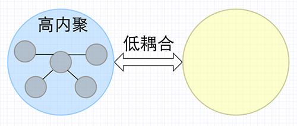
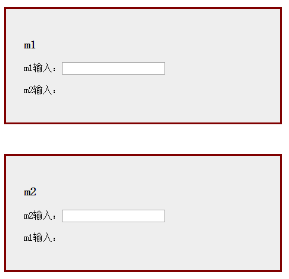
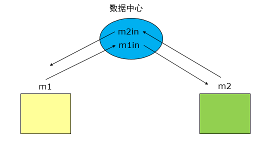
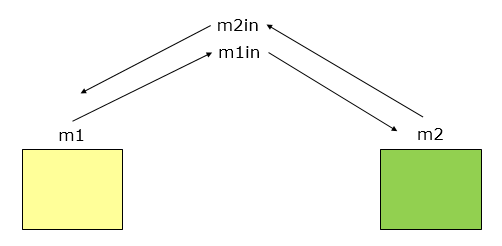
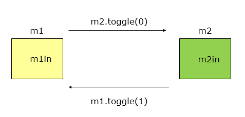
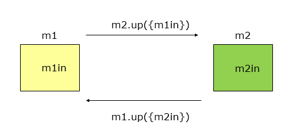
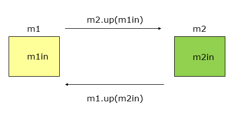
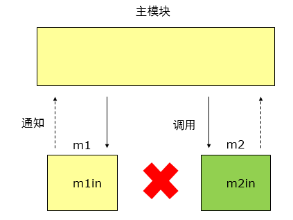

## 图解7种耦合关系
> 本文首发于 [图解7种耦合关系](https://yanhaijing.com/program/2016/09/01/about-coupling/)

### 高内聚与低耦合
高内聚与低耦合是每个软件开发者追求的目标，那么内聚和耦合分别是什么意思呢？


	内聚是从功能角度来度量模块内的联系，一个好的内聚模块应当恰好做一件事。它描述的是模块内的功能联系。

	耦合是软件结构中各模块之间相互连接的一种度量，耦合强弱取决于模块间接口的复杂程度、进入或访问一个模块的点以及通过接口的数据。

### 耦合
不同模块之间的关系就是耦合，根据耦合程度可以分为7种，耦合度依次变低。

* 内容耦合
* 公共耦合
* 外部耦合
* 控制耦合
* 标记耦合
* 数据耦合
* 非直接耦合

下面我们来说说每种耦合是什么，开始之前先来说下要实现的功能。m1和m2是两个独立的模块，其中m2种会显示m1的输入，m1会显示m2的输入。


很显然，m1和m2两个模块之间会有一些联系（耦合），你也可以想想如何实现这个功能，下面用7种不同的方式来实现这个功能。

注：项目的代码我放到了[github](https://github.com/yanhaijing/coupling)，项目的[demo](http://yanhaijing.com/coupling/)，可以在这里查看。

### 内容耦合
内容耦合是最紧的耦合程度，一个模块直接访问另一模块的内容，则称这两个模块为内容耦合。


为了实现功能，我们将m1的输入放到m2.m1input上，将m2的输入放到m1.m2input上。
```js
// m1.js
root.m2.m1input = this.value;
m2.update();

// m2.js
root.m1.m2input = this.value;
m1.update();
```
PS:不知道谁会这么写代码，除了我为了做演示之外。。。

### 公共耦合
一组模块都访问同一个全局数据结构，则称之为公共耦合。


在这种case中，m1和m2将自己的输入放到全局的data上。
```js
// m1.js
root.data.m1input = this.value;
m2.update();

// m2.js
root.data.m2input = this.value;
m1.update();
```

### 外部耦合
一组模块都访问同一全局简单变量，而且不通过参数表传递该全局变量的信息，则称之为外部耦合。外部耦合和公共耦合很像，区别就是一个是简单变量，一个是复杂数据结构。


在这种case中，m1和m2都将自己的输入放到全局上。
```js
// m1.js
root.m1input = this.value;
m2.update();

// m2.js
root.m2input = this.value;
m1.update();
```

### 控制耦合
模块之间传递的不是数据信息，而是控制信息例如标志、开关量等，一个模块控制了另一个模块的功能。

从控制耦合开始，模块的数据就放在自己内部了，不同模块之间通过接口互相调用。


在这个case中，得增加一个需求，就是当m1的输入为空时，隐藏m2的显示信息。
```js
// m1.js
root.m1input = this.value;
m2.update();

m2.toggle(!!this.value); // 传递flag
```
上面的代码中m1直接控制了m2的显示和隐藏。

### 标记耦合
调用模块和被调用模块之间传递数据结构而不是简单数据，同时也称作特征耦合。


在这个case中，m1传给m2的是一个对象。
```js
// m1.js
me.m1input = this.value;
m2.update(me); // 传递引用

// m2.js
me.m2input = this.value;
m1.update(me);
```

### 数据耦合
调用模块和被调用模块之间只传递简单的数据项参数。相当于高级语言中的值传递。


在这个case中，m1传给m2的是一个简单数据结构。
```js
// m1.js
me.m1input = this.value;
m2.update(me.m1input); // 传递值

// m2.js
me.m2input = this.value;
m1.update(me.m2input);
```

### 非直接耦合
两个模块之间没有直接关系，它们之间的联系完全是通过主模块的控制和调用来实现的。耦合度最弱，模块独立性最强。

子模块无需知道对方的存在，子模块之间的联系，全部变成子模块和主模块之间的联系。


在这个case种，增加一个index.js作为主模块。
```js
// index.js
var m1 = root.m1;
var m2 = root.m2;

m1.init(function (str) {
    m2.update(str);
});

m2.init(function (str) {
    m1.update(str);
});

// m1.js
me.m1input = this.value;
inputcb(me.m1input); // inputcb是回调函数

// m2.js
me.m2input = this.value;
inputcb(me.m2input);
```