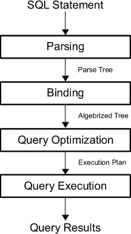
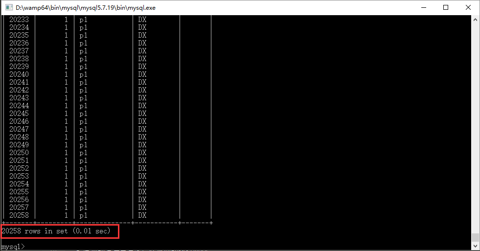

## SQL 语句优化

SQL 语句优化主要涉及两个方面：一些普遍遵循的原则；SQL 语句性能分析及优化。


### SQL 语句处理的四个阶段

为了提高 SQL 查询的性能，我们首先需要知道其执行时内部流程。
Microsoft SQL Server 2012 Internals 把 SQL 语句的处理分为四个阶段，分别是解析、绑定、优化、执行，如图所示：



* 解析（Parse）主要是语法分析，把 SQL 解析成“解析树”，分析查询是否符合语法。
* 绑定（Bind）验证查询中用到的表与列是否存在；加载这些表和列的元数据；识别查询中所有的数据类型；为 algebrized tree 中所需要的隐式数据转换（类型转换）添加必要的信息；对查询中所有的视图，用其定义替换；核实 GROUP BY 以及聚集函数的使用是否得当；并执行一些简单的基于语法的优化。
* 优化（Optimize）查询优化器，获取上一步生成的结构优化后的 algebrized tree，计算生成最优执行查询计划。但因查询优化器不够完善，其中有很多并没有做到真正的最优。
* 执行（excute）执行上一步给出的查询计划，返回执行结果。


### SQL 常用基本语句优化 10 个原则

1. 尽量避免在列上进行运算，这样会导致索引失效。
```sql
SELECT * FROM table WHERE YEAR(date) > 2011; 	
优化为：
SELECT * FROM table WHERE date > '2011-01-01';

SELECT * FROM table WHERE year + 10 = 1980;
优化为：
SELECT * FROM table WHERE year = 1970;
```

2. 使用 JOIN 时，应该用小结果集驱动大结果集。同时把复杂的 JOIN 查询拆分成多个 Query。因为 JOIN 多个表时，可能导致更多的锁定和阻塞。

3. 尽量避免使用`LIKE %...%`模糊查询，`LIKE %...%`模糊查询不使用索引。
```sql
SELECT * FROM table WHERE name LIKE %de%; 
优化为：
SELECT * FROM table WHERE name >= 'de' AND name < 'df'; 
```

4. 仅查询出需要查询的数据。

5. 使用批量插入语句晋升交互。
```sql
INSERT INTO table (name, age) VALUES ('张三', 23);
INSERT INTO table (name, age) VALUES ('李四', 24);
INSERT INTO table (name, age) VALUES ('王五', 25);
优化为：
INSERT INTO table (name, age) VALUES ('张三', 23),('李四', 24),('王五', 25);
```

6. LIMIT 的基数越大速度越慢。
```sql
SELECT * FROM table ORDER BY id LIMIT 1000000,10;
优化为：
SELECT * FROM table WHERE id BETWEEN 1000000 AND 1000010 ORDER BY id;
```
`BETWEEN`限定比`LIMIT`快，所以在大批量数据访问时，建议用`BETWEEN`替换掉`LIMIT`。但是`BETWEEN`也有明显的缺陷，即：如果id是不连续的情况下，那么读取的数据条数就会出现错误。

7. 使用 OR 查询应该注意 OR 查询有可能不使用索引。
使用 OR 链接的各个 WHERE 列如果有任何一个列没有索引，那么此次查询就没有使用索引。

8. 使用联合索引注意最左原则。

9. 不要使用 count(id), 而应该是 count(\*)。
count(id) 要判断每行是不是 NULL，当引擎发现列不可能是 NULL 时会转化为 count(\*)。

10. 不要做无所谓的排序操作，而应尽可能在索引中完成排序。


### SQL 性能分析

如何知道 SQL 执行效率的高低呢？

* 最直观的方法查看客户端返回的执行时间。
如图所示：


* 通过开启性能分析开关查看。
例如：
```
mysql> set @@profiling = 1;
mysql> select * from user_info;
mysql> select * from order_info limit 0,10;
mysql> select * from user_info;
mysql> select * from order_info;
mysql> show profiles;
```
输出：
```
mysql> show profiles;
+----------+------------+-------------------------------------+
| Query_ID | Duration   | Query                               |
+----------+------------+-------------------------------------+
|        1 | 0.00017300 | select * from user_info             |
|        2 | 0.00052400 | select * from order_info limit 0,10 |
|        3 | 0.00035675 | select * from user_info             |
|        4 | 0.01022750 | select * from order_info            |
+----------+------------+-------------------------------------+
4 rows in set, 1 warning (0.00 sec)
```

* 通过 Query_ID 查看 SQL 语句具体执行细节。
```
mysql> show profile for query 4;
+----------------------+----------+
| Status               | Duration |
+----------------------+----------+
| starting             | 0.000047 |
| checking permissions | 0.000004 |
| Opening tables       | 0.000014 |
| init                 | 0.000011 |
| System lock          | 0.000005 |
| optimizing           | 0.000002 |
| statistics           | 0.000010 |
| preparing            | 0.000006 |
| executing            | 0.000001 |
| Sending data         | 0.010089 |
| end                  | 0.000004 |
| query end            | 0.000005 |
| closing tables       | 0.000004 |
| freeing items        | 0.000020 |
| cleaning up          | 0.000007 |
+----------------------+----------+
15 rows in set, 1 warning (0.00 sec)
```

* 通过 EXPLAIN 查询 MYSQL 执行计划，Oracle 中是 EXPLAIN PLAN 语句，SQLite 中使用 EXPLAIN QUERY PLAN。
```
mysql> EXPLAIN SELECT * FROM user_info WHERE id=1;
+----+-------------+-----------+------------+-------+---------------+---------+---------+-------+------+----------+-------+
| id | select_type | table     | partitions | type  | possible_keys | key     | key_len | ref   | rows | filtered | Extra |
+----+-------------+-----------+------------+-------+---------------+---------+---------+-------+------+----------+-------+
|  1 | SIMPLE      | user_info | NULL       | const | PRIMARY       | PRIMARY | 8       | const |    1 |   100.00 | NULL  |
+----+-------------+-----------+------------+-------+---------------+---------+---------+-------+------+----------+-------+
1 row in set, 1 warning (0.00 sec)
```
*使用 EXPLAIN 输出的各个字段的含义->[传送阵](https://github.com/Whale-Design/tech-blog/tree/master/Lips-gp/2018-12-11/README.md)*