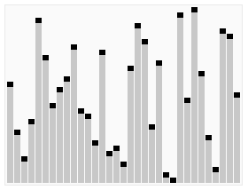

## PHP 实现快速排序

> 本文首发于 [PHP 实现快速排序](https://www.jianshu.com/p/56c09d431443)

### 快速排序定义
**快速排序（Quicksort）**，又称**划分交换排序（partition-exchange sort）**，简称快排，一种排序算法，最早由东尼·霍尔提出。在平均状况下，排序 n 个项目要 O(n log n) 次比较。在最坏状况下则需要 O(n2) 次比较，但这种状况并不常见。事实上，快速排序 O(n log n) 通常明显比其他算法更快，因为它的内部循环（inner loop）可以在大部分的架构上很有效率地达成。

### 快速排序基本原理
从数列中挑出一个元素，称为"基准"（pivot），重新排序数列，所有比基准值小的元素摆放在基准前面，所有比基准值大的元素摆在基准后面（相同的数可以到任何一边）。在这个分区结束之后，该基准就处于数列的中间位置。这个称为分区（partition）操作。递归地（recursively）把小于基准值元素的子数列和大于基准值元素的子数列进行该中方法的排序。

如图所示：



### PHP 代码实例
``` php
<?php

$arr = [33, 24, 8, 21, 2, 23, 3, 32, 16];

/**
 * [quickSort 快速排序]
 * @param  array  $arr  [要排序的数组]
 * @param  string $type [asc正序/desc倒序]
 * @return array       [完成排序的数组]
 */
function quickSort(array $arr, $type = 'asc')
{
    $count = count($arr);

    if ($count < 2) {
        return $arr;
    }

    $leftArray = $rightArray = array();
    $middle = $arr[0];// 基准值

    for ($i = 1; $i < $count; $i++) {
        // 小于基准值，存入左边；大于基准值，存入右边
        if ($arr[$i] < $middle) {
            $leftArray[] = $arr[$i];
        } else {
            $rightArray[] = $arr[$i];
        }
    }

    $leftArray = quickSort($leftArray);
    $rightArray = quickSort($rightArray);

    // 正序
    if($type == 'asc')
    	return array_merge($leftArray, array($middle), $rightArray);

    // 倒序
    if($type == 'desc')
    	return array_merge($rightArray, array($middle), $leftArray);
}

print_r(quickSort($arr));
```
``` php
输出：Array ( [0] => 2 [1] => 3 [2] => 8 [3] => 16 [4] => 21 [5] => 23 [6] => 24 [7] => 32 [8] => 33 ) 
```