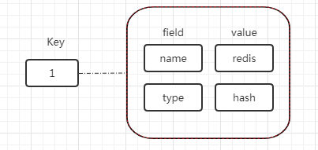
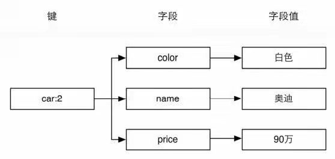
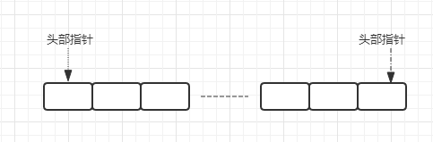
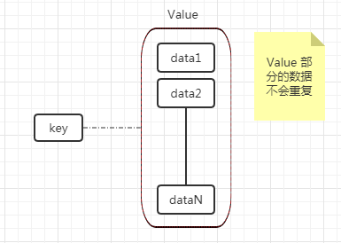

## Redis 数据类型及应用场景

### 一、 redis 简介
Redis 是 REmote DIctionary Server（远程字典服务器）的缩写，它以字典结构存储数据，并允许其他应用通过 TCP 协议读写字典中的内容。同大多数脚本语言中的字典一样，Redis字典中的键值除了可以是字符串，还可以是其他数据类型。到目前为止 Redis 支持的键值数据类型如下：
* 字符串类型
* 散列类型
* 列表类型
* 集合类型
* 有序集合类型

这种字典形式的存储结构与常见的MySQL等关系数据库的二维表形式的存储结构有很大的差异。
1. 从类型上来说，mysql是关系型数据库，redis是缓存数据库
2. mysql用于持久化的存储数据到硬盘，功能强大，但是速度较慢；redis用于存储使用较为频繁的数据到缓存中，读取速度快。
3. mysql和redis因为需求的不同，一般都是配合使用。

### 二、 redis 特点
* 所有数据存储在内存中，高速读写
* 提供丰富多样的数据类型：string、 hash、 set、 sorted set、bitmap、hyperloglog
提供了 AOF 和 RDB 两种数据的持久化保存方式，保证了 Redis 重启后数据不丢失
* Redis 的所有操作都是原子性的，还支持对几个操作合并后的原子性操作，支持事务

通常我们都把数据存到关系型数据库中，但为了提升应用的性能，我们应该把访频率高且不会经常变动的数据缓存到内存中。。Redis 没有像 MySQL 这类关系型数据库那样强大的查询功能，需要考虑如何把关系型数据库中的数据，合理的对应到缓存的 key-value 数据结构中。

### 三、 字符串（String）数据类型的应用场景

#### 1. 简介
string 类型是 Redis 中最基本的数据类型，最常用的数据类型，甚至被很多玩家当成 redis 唯一的数据类型去使用。string 类型在 redis 中是二进制安全(binary safe)的,这意味着 string 值关心二进制的字符串，不关心具体格式，你可以用它存储 json 格式或 JPEG 图片格式的字符串。

#### 2. 数据模型
string 类型是基本的 Key-Value 结构，Key 是某个数据在 Redis 中的唯一标识，Value 是具体的数据。
| Key | Value |
| -- | -- |
| name | redis |
| type | string |

因为需根据 Redis 中设置的唯一标示 Key 来设置或找到其对应的 Value 值，所以必须保证其唯一性，否则新设置的 Value 值就会覆盖原值。

#### 3. 应用场景

(1) 存储普通字符串值，如：

	set name goapan

然因为我们经常会让其配合 MySQL 数据库使用，所以我们一般会存储一些 MySQL 的热点数据（如：网站首页，热门赛事等）。
所以在存储普通字符串时我们经常会把 key 设计为

	表名：主键名：主键值：字段名

eg.

	set user:id:1:email 156577812@qq.com

#### (2) 生成自增 id
当 redis 的 string 类型的值为整数形式时，redis 可以把它当做是整数一样进行自增（incr）自减（decr）操作。由于 redis 所有的操作都是原子性的，所以不必担心多客户端连接时可能出现的事务问题。

eg.
```
127.0.0.1:6379> incr id
(integer) 1
```
默认自增步长值是 1，且如果没有设置 id 则默认其值是 0，所以上述命令执行结果是 1。

#### (3) 存储对象


| id | name | email |
| -- | -- | -- |
| 1 | zj | 156577812@qq.com |
| 2 | ai | 156577813@qq.com |

string 类型支持任何格式的字符串，应用最多的就是存储 json 或其他对象格式化的字符串。(这种场景下更推荐使用散列数据类型，原因我们会在下面讲到散列时再具体说)

	set user '[{"id":1,"name":"zj","email":"156577812@qq.com"},{"id":1,"name":"zj","email":"156577812@qq.com"}]'
在这儿我们可以想一下将 json 对象转成 json 字符串存储的弊端：
1. 比如我们要用到 user 表某一列数据时必须将其全部数据读取出来。
2. 如果我们表数据发生变化是同样我们需要将其全部读取，先转成 json 对象，然后更新，然后再转成 json 字符串存储。

### 四、散列（hash）数据类型的应用场景

#### 1. 简介
hash 类型的键值也是一种字典结构，其存储了字段和字段值得映射，但字段值只支持字符串，不支持其他数据类型。所以散列类型不能嵌套其他的数据类型。一个散列类型键可以包含最多 2^32-1 个字段。

*除了散列类型，redis 其他数据类型也不支持数据类型的嵌套。*
　　
#### 2. 数据模型



hash数据类型在存储上述类型的数据时具有比 string 类型更灵活、更快的优势，具体的说，使用 string 类型存储，必然需要转换和解析 json 格式的字符串，即便不需要转换，在内存开销方面，还是 hash 占优势。

#### 3. 应用场景
散列类型适合存储对象：使用对象类别和ID构成键名，使用字段表示对象的属性，而字段值则存储属性值。例如要存储ID为2的汽车对象，可以分别使用名为color、name和price的3个字段来存储该辆汽车的颜色、名称和价格。存储结构如图所示：


相比于关系型数据库其优势是不同数据其字段结构可以不一样，这样就可以避免一些冗余的数据。

### 五、列表（list）数据类型的应用场景

#### 1. 简介
列表类型（list）可以存储一个有序的字符串列表，常用的操作是向列表两端添加元素，或者获得列表的某一个片段。
列表类型内部是使用双向链表（double linked list）实现的，所以向列表两端添加元素的时间复杂度为O(1)，获取越接近两端的元素速度就越快。这意味着即使是一个有几千万个元素的列表，获取头部或尾部的10条记录也是极快的（和从只有20个元素的列表中获取头部或尾部的10条记录的速度是一样的）。与散列类型键最多能容纳的字段数量相同，一个列表类型键最多能容纳 2^32-1 个元素。

#### 2. 数据模型



#### 3. 应用场景
(1) 消息队列

redis 的 list 数据类型对于大部分使用者来说，是实现队列服务的最经济，最简单的方式。

(2) “最新内容”

因为 list 结构的数据查询两端附近的数据性能非常好，所以适合一些需要获取最新数据的场景，比如新闻类应用的 “最近新闻”。列表类型也适合用来记录日志，可以保证加入新日志的速度不会受到已有日志数量的影响。

### 六、集合（set）数据类型的应用场景
#### 1. 简介
集合数据类型是一个集合，在集合中每个元素都是不同的，且没有顺序。一个集合类型键可以存储最多 2^32-1 个字符串。，集合类型常用操作是对集合数据进行添加、删除、判断是否存在等操作，由于集合类型在 Redis 内部是使用值为空的 hash table 实现的，所以这些操作的时间复杂度都是 O(1) 。

集合类型提供了多个集合之间的聚合运算，如求交集、并集、补集，这些操作在 redis 内部完成，效率很高。

#### 2. 数据模型


#### 3. 应用场景
集合类型的特点是——不重复且无序的一组数据，并且具有丰富的计算功能，在一些特定的场景中可以高效的解决一般关系型数据库不方便做的工作。

(1) “共同好友列表”

社交类应用中，获取两个人或多个人的共同好友，两个人或多个人共同关注的微博这样类似的功能，用 MySQL 的话操作很复杂，可以把每个人的好友 id 存到集合中，获取共同好友的操作就可以简单到一个取交集的命令就搞定。
```
// 这里为了方便阅读，把 id 替换成姓名
sadd user:wade james melo paul kobe
sadd user:james wade melo paul kobe
sadd user:paul wade james melo kobe
sadd user:melo wade james paul kobe

// 获取 wade 和 james 的共同好友
sinter user:wade user:james
/* 输出：
 *      1) "kobe"
 *      2) "paul"
 *      3) "melo"
 */
 
 // 获取四人的共同好友
 sinter user:wade user:james user:paul user:melo
 /* 输出：
 *      1) "kobe"
 */
 
 /*
     类似的需求还有很多 , 比如把每个标签下的文章 id 存到集合中，可以很容易的求出几个不同标签下的共同文章；
 把每个人的爱好存到集合中，可以很容易的求出几个人的共同爱好。 
 */
```

### 七、sorted set 数据类型的应用场景

#### 1.简介
在集合的基础上给集合中每个元素关联了一个分数，往有序集合中插入数据时会自动根据这个分数排序。虽然集合中的每个元素是不可以相同的，但是他们的分数却是可以相同的。

有序集合类型在某些方面和列表类型有些相似。
1. 二者都是有序的。
2. 二者都可以获得某一范围的元素。

但是二者有着很大的区别，这使得它们的应用场景也是不同的。
1. 列表类型是通过链表实现的，获取靠近两端的数据速度极快，而当元素增多后，访问中间数据的速度会较慢，所以它更加适合实现如“新鲜事”或“日志”这样很少访问中间元素的应用。
2. 有序集合类型是使用散列表和跳跃表（Skip list）实现的，所以即使读取位于中间部分的数据速度也很快（时间复杂度是O(log(N))）。
3. 列表中不能简单地调整某个元素的位置，但是有序集合可以（通过更改这个元素的分数）。
4. 有序集合要比列表类型更耗费内存。

#### 2.应用场景
在集合类型的场景上加入排序就是有序集合的应用场景了。比如根据好友的“亲密度”排序显示好友列表。
```
// 用元素的分数（score）表示与好友的亲密度
zadd user:kobe 80 james 90 wade  85 melo  90 paul

// 根据“亲密度”给好友排序
zrevrange user:kobe 0 -1

/**
 * 输出：
 *      1) "wade"
 *      2) "paul"
 *      3) "melo"
 *      4) "james"
 */
 
// 增加好友的亲密度
zincrby user:kobe 15 james

// 再次根据“亲密度”给好友排序
zrevrange user:kobe 0 -1

/**
 * 输出：
 *      1) "james"
 *      2) "wade"
 *      3) "paul"
 *      2) "melo"
 */
 
 //类似的需求还出现在根据文章的阅读量或点赞量对文章列表排序
```