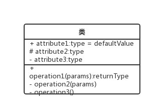
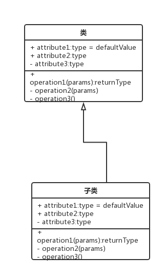
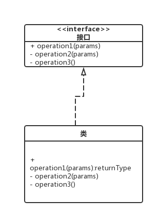
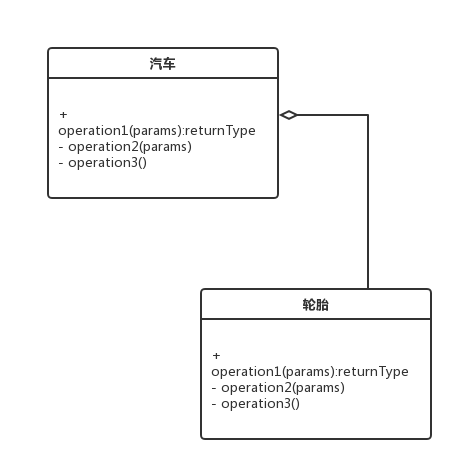
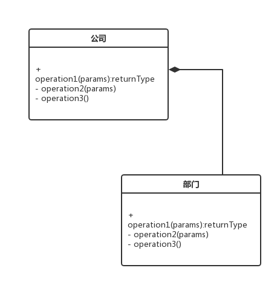
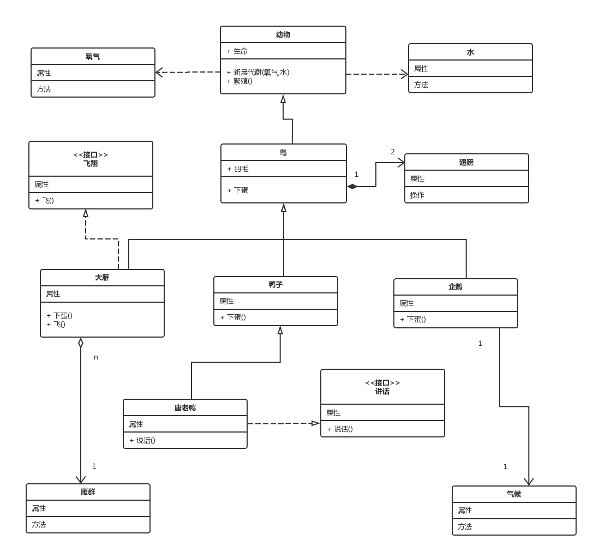

### UML图之类图
身为一名软件开发人员，在我们平时阅读分析类文章或是应用架构时经常会与UML图打交道，下面让我们来认识一些UML图吧。
面向对象问题处理的关键其实就是建模问题，建模可以把在复杂时间里许多重要的细节给抽象出来，因此诞生了Unified Modeling Language，也就是统一建模语言 UML。  
在UML里共有9中建模类型，分别为：  
- 用例图
- 类图
- 对象图
- 顺序图
- 协作图
- 状态图
- 活动图
- 组件图
- 配置图 

本章我们主要来讲UML中最常用的类图:

#### 类
在UML类图中,类使用带有分割线的柜型包括类名,属性,和方法来表示。如下图表示一个类。

属性的表示规则: 可见性 名称 : 类型 [=缺省值]  
方法的表示规则: 可见性 名称(参数列表) [:返回类型]

### 类的关系

在UML类图中,常见的关联有泛化,实现,关联,聚合,组合,依赖等几种。
* 泛化

泛化是一种继承关系，表示一般与特殊的关系，它指定了之类如何特化弗雷的所有特征和行为。对应关键字为extend。
如：老虎是动物的一种,即有老虎的特征也有动物的共性。
表示方式：常用带三角箭头的实线，箭头指向父类。

* 实现
实现是一种类与接口的关系,表示类是接口的所有特征和行为的实现.对应implement关键字

* 关联

关联是一种拥有关系,它使一个类知道领一个类的属性和方法。通常用实心线标识，关联又分为单项关联和双向关联,双向关联可以有两个箭头或者没有箭头，单项的关联有一个箭头。通常使用成员变量存储。

* 聚合
聚合是整体与部分的关系,且部分可以离开整体而存在.
如:车和轮胎,轮胎离开车仍然可以存在.
使用空心的菱形和实心线标识,菱形指向整体

* 组合
组合是整体与部分的关系,但部分不能离开整体而单独存在
如:公司和部门.

* 依赖
依赖是一种使用的关系,即一个类需要另一个类的协助,其中一个事物的变化会影响另一个事物.
所以尽量不要使用双向依赖
依赖使用场景通常出现在局部变量,方法参数或者静态方法调用等.
依赖使用带箭头的虚线表示,指向被使用者.

下面请看一张各完整关系图:

### 类图绘制要点

* 类的操作是针对自身的操作,而不是操作人家,比如书有上下架的操作,是书自己被上下架,不能因为是管理员的动作而吧他放在管理员操作里
* 两个相关联的类,需要再关联的勒种加上被关联类的id,并且箭头指向被关联类,可以理解为数据表的外键,比如借书,借书需要用到书的信息,因此借书类需要包含数的id,箭头指向书.
* 由于业务复杂性,一个显示中的实体可能会被分为多个类，这是很正常的，类不是越少越好。类的设计取决于怎样让后台程序的操作更加简单。比如单看逻辑，借书类可以不存在，它的信息可以放在书这个类里。然而借还书和书的上架下架完全不是一回事，借书类对借书的操作更加方便，不需要去重复改动书这个类中的内容。此外，如果书和借书是1对多的关系，那就必须分为两个类。

参考资料:http://www.uml.org.cn/oobject/201610282.asp

