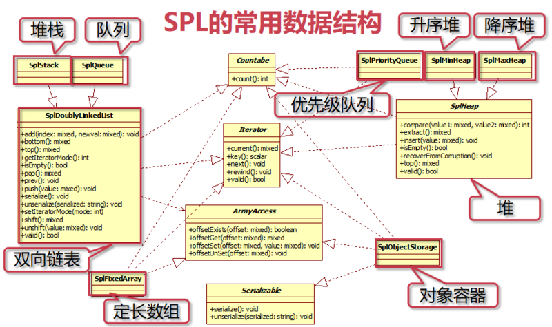
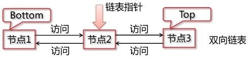
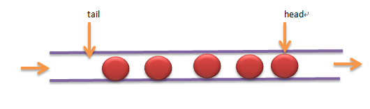
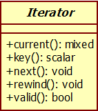

### PHP标准库SPL笔记之数据结构、迭代器和接口
参考：  
http://php.net/manual/zh/book.spl.php   
https://segmentfault.com/a/1190000014479581    
http://www.ruanyifeng.com/blog/2008/07/php_spl_notes.html  

### 一、SPL简介
- 什么是SPL  
  SPL是Standard PHP Library（PHP标准库）的缩写。它应该是属于PHP中的高级内容，看上去很复杂，其实非常有用。官网的解释是：SPL是用于解决典型问题（standard problems）的一组接口与类的集合。  
  常见典型问题
```
    数据结构 
        解决数据怎么存储问题
    元素遍历
        数据怎么查看问题
    常用方法的统一调用
        数组、集合大小
        自定义遍历
    类自动加载
        spl_autoload_register
```  
   SPL包含了数据结构、基础接口、基础函数、迭代器、异常以及其他一些类和接口,下面我们来分别认识。
### 二、 SPL数据结构  
   数据结构是计算机存储、组织数据的方式。SPL提供了双向链表、堆栈、队列、堆、降序堆、升序堆、优先级队列、定长数组、对象容器等。之前我们学习过UML类图，下面我们就用一张类图来进行表示。
   
  
   * 双向链表 SplDoublyLinkedList
   SplDoublyLinkedList实现了Iterator、ArrayAccess、Countable接口。
     
   
    Bottom：最先添加到链表中的节点叫做Bottom(底部)，也称为头部(head)  
    Top：最后添加到链表中得节点叫做top顶部，也称为尾部  
    链表指针:是一个当前关注的节点的标识，可以指向任意节点  
    当前指针：链表指针指向的节点称为当前节点  
    节点名称：可以在链表中唯一标识一个节点的名称，通常又称为节点的key或offset  
    节点数据：存放在链表中的应用数据，通常称为value  
   
   双向链表常用方法：  
     Bottom: 获得链表底部（头部）元素，当前指针位置不变  
     Top: 获取链表顶部（尾部）元素，当前指针位置不变  
     Push: 往链表顶部(Top)中追加节点  
     Pop: 从链表顶部弹出一个节点，不改变当前指针的位置  
     Unshif: 往链表底部追加节点，不会改变指针位置  
     Shif: 从链表底部弹出一个节点，不会改变指针位置  
     Rewind: 将链表的当前指针指向第一个元素 
     Current: 链表当前指针。当指向的节点被删除之后，会指向一个空节点  
     Next: 指针指向下一个节点，current的返回值随之改变  
     Prev: 上一个  
     offsetExists： 可以理解为key是否存在  
     offsetGet： 把key节点拿出来  
     offsetSet： 更新数据  
     offsetUnset： 删除  
     
```
    <?php
    $obj = new SplDoublyLinkedList();
    $obj->push(4);
    $obj->push(6);
    $obj->unshift(66);
    print_r($obj);
```

```
    SplDoublyLinkedList Object
    (
        [flags:SplDoublyLinkedList:private] => 0
        [dllist:SplDoublyLinkedList:private] => Array
            (
                [0] => 66
                [1] => 4
                [2] => 6
            )
    
    )
```  

* 栈 SplStack  
    SplStack继承了双向链表 SplDoublyLinkedList。
   栈是一种特殊的线性表，只能在线性表一段进行插入和删除。栈是一种后进先出的数据结构。
   常用操作：  
    bottom：最先进入的元素  
    top： 最后一个元素  
    注意：堆栈的rewind指向的是top（尾部），双链表的rewind指向的确实bottom（头部）。堆栈和双链表都有next方法，方向相反。  
```
    <?php
    $stack = new SplStack();
    $stack->push(1);
    $stack->push(2);
    $stack->push(3);
    
    echo 'bottom:'.$stack -> bottom().PHP_EOL;
    echo "top:".$stack->top().PHP_EOL;
    //堆栈的offset=0,是top所在位置（即栈的末尾）
    $stack -> offsetSet(0, 10);
    echo "top:".$stack->top().'<br/>';
    
    //堆栈的rewind和双向链表的rewind相反，堆栈的rewind使得当前指针指向top所在位置，而双向链表调用之后指向bottom所在位置
    $stack -> rewind();
    echo 'current:'.$stack->current().'<br/>';
    
    $stack ->next();//堆栈的next操作使指针指向靠近bottom位置的下一个节点，而双向链表是靠近top的下一个节点
    echo 'current:'.$stack ->current().'<br/>';
    //遍历堆栈
    $stack -> rewind();
    while ($stack->valid()) {
        echo $stack->key().'=>'.$stack->current().PHP_EOL;
        $stack->next();//不从链表中删除元素
    }
    echo '<br/>';
    //取出
    echo $stack->pop() .'--';
    echo $stack->pop() .'--';
    echo $stack->pop() .'--';
```  
输出：
```
    bottom:1 top:3 top:10
    current:10
    current:2
    2=>10 1=>2 0=>1 
    10--2--1--
```  

* 队列 SqlQueue  
    队列是一种先进先出的数据结构，使用队列时插入在一段，删除在另一端。
    SplQueue也是继承自双向链表SplDoublyLinkedList，并有自己的方法。  
      
    常用操作：  
     enqueue： 插入一个节点到队列里面的top位置  
     dequeue: 操作从队列中提取Bottom位置的节点,同时从队列里面删除该元素  
     offSet(0): 是Bottom所在的位置  
     rewind: 操作使得指针指向Bottom所在的位置的节点  
     next: 操作使得当前指针指向Top方向的下一个节点   

```
    $obj = new SplQueue();
    $obj->enqueue('a');
    $obj->enqueue('b');
    $obj->enqueue('c');
    print_r($obj);
```   
```
    SplQueue Object
    (
        [flags:SplDoublyLinkedList:private] => 4
        [dllist:SplDoublyLinkedList:private] => Array
            (
                [0] => a
                [1] => b
                [2] => c
            )
    )
```   
 
    另外SPL还提供了：  
    SplHeap 堆  
    SplMaxHeap 最大堆  
    SqlMinHeap 最小堆  
    SplPriorityQueue 优先级队列  
    SplFixedArray 定长数组  
    SplObjectStorage 对象容器 等
    具体的可以参考http://php.net/manual/zh/spl.datastructures.php  

 
### 三、SPL迭代器  
   SPL的核心概念就是Iterator，PHP-SPL提供了多个迭代器类，分别提供了像迭代访问、过滤数据、缓存结果、控制分页等功能。通俗来说，Iterator能够使许多不同的数据结构，都能有统一的操作界面，比如一个数据库的结果集、同一个目录中的文件集、或者一个文本中每一行构成的集合等。  
   其实前面我们学习的生成器generator（yield），就是继承自迭代器Interator，并且多了一个send（），与标准迭代器不同的是，生成器不要求类实现Iterator接口。  
   PHP中迭代器是通过Iterator接口定义的  
     
   
* ArrayIterator迭代器   
    ArrayIterator迭代器用于遍历数组  
    seek（），指定定位到某个位置，跳过前面n-1的元素  
    ksort（），对key进行字典序排序  
    asort（），对值进行字典序排序  
    
```
    $arr=array(
        'apple' => 'apple value', // position = 0
        'orange' => 'orange value', // position = 1
        'grape' => 'grape value',
        'plum' => 'plum value'
    );
    $obj=new ArrayObject($arr);
    $it =$obj->getIterator();//生成数组的迭代器。
    foreach ($it as $key => $value){
        echo $key . ":". $value .'<br />';
    }
    
    echo '<br />';
    //实现和foreach同样功能
    $it->rewind();// 调用current之前一定要调用rewind
    While($it->valid()){//判断当前是否为有效数据
        echo $it->key().' : '.$it->current().'<br />';
        $it->next();//千万不能少
    }
    
    //实现更复杂功能，跳过某些元素进行打印
    $it->rewind();
    if ($it->valid()){
        $it->seek(1);//position，跳过前面 n-1的元素
        While($it->valid()){//判断当前是否为有效数据
            echo $it->key().' : '.$it->current().'<br />';
            $it->next();//千万不能少
        }
    }
    
    $it->ksort();//对key进行字典序排序
    //$it->asort();//对值进行字典序排序
    foreach ($it as $key => $value){
        echo $key . ":". $value .'<br />';
    }
```  
    foreach本身会自动生成一个迭代器，但如果要实现复杂需求，foreach实现不了，就要手动生成迭代器对象来使用了。  

* AppendIterator 迭代器  按顺序迭代几个不同迭代器，这个迭代器的append方法类似于array_merge来合并数组  
```
    $arr_a = new ArrayIterator(array('a'=> array('a','b'=>234),'b','c'));
    $arr_b = new ArrayIterator(array('d','e','f'));
    $it = new AppendIterator();
    $it->append($arr_a);//追加数组
    $it->append($arr_b);//追加数组，然后遍历$it
    foreach ($it as $key => $value){
        print_r($value);
    }
```
* MultipleIterator 迭代器 用于吧多个Iterator里的数据组合成一个整体来访问  
* LimitIterator 从集合中取出结果的起始索引点返回给定数量的结果  
* FilterIterator 基于OuterIterator接口，返回符合条件的元素，必须实现一个抽象方法accept  
* RegexIterator 使用正则表达式匹配修改迭代器中元素，通常用于字符串匹配  
* SeekableIterator 创建非顺序访问迭代器，允许直接跳转到迭代器中任何一点上  
* RecursiveArrayIterator 创建一个用于递归形式的迭代器，类似于多维数组，它为许多更负责的迭代器提供了所需操作  
* ....  

### 四、SPL基础接口  
    Countable：继承了该接口的类可以直接调用count()，得到元素个数
    OuterIterator：，如果想对迭代器进行一定的处理之后再返回，可以用这个接口，相当于进行了一次封装，对原来的进行一定的处理
    RecursiveIterator：，可以对多层结构的迭代器进行迭代，比如遍历一棵树，类似于filesystemIterator，关键方法hasChildren，getChildren，实现该接口的类有RecursiveArrayIterator，RecursiveCachingIterator等以Recursive开头的类
    SeekableIterator：,可以通过seek方法定位到集合里面的某个特定元素,seek方法的参数是元素位置，从0计算，实现该接口的类有ArrayIterator，DirectoryIterator，FilesystemIterator，GlobIterator，RecursiveArrayIterator等    
    
```
    $arr = array(
        array('name' => 'name value', 'id' => 2),
        array('name' => 'Peter', 'id' => 4, 'age' => 22),
    );
    echo count($arr);
    echo count($arr[1]);
    
    class CountMe implements Countable
    {
        protected $myCount = 6;
        protected $myCount2 = 3;
        protected $myCount3 = 2;
        public function count()
        {
            // TODO: Implement count() method.
            return $this->myCount;
        }
    }
    $obj = new CountMe();
    echo count($obj); //6
```
 
```
  $array = ['Value1','Value2','Value3','Value4'];
  $outerObj = new OuterImpl(new ArrayIterator($array));
  foreach ($outerObj as $key => $value){
      echo "++".$key.'-'.$value."\n";
  }
  
  class OuterImpl extends IteratorIterator
  {
      public function current()
      {
          return parent::current()."_tail";
      }
  
      public function key()
      {
          return "Pre_".parent::key();
      }
  }
```  

```
  ++Pre_0-Value1_tail
  ++Pre_1-Value2_tail
  ++Pre_2-Value3_tail
  ++Pre_3-Value4_tail
  
```  

