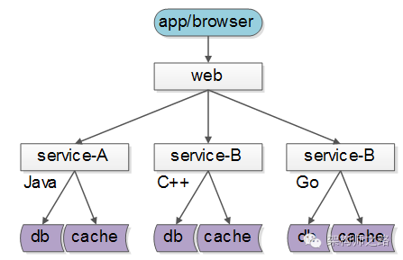
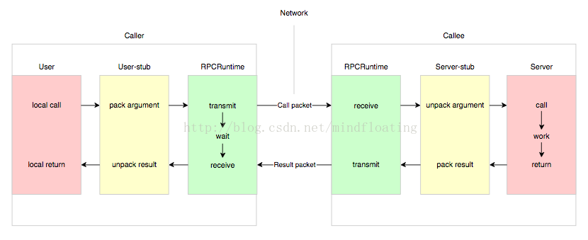
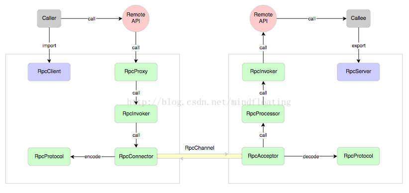
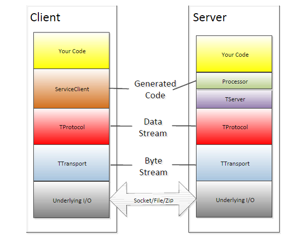
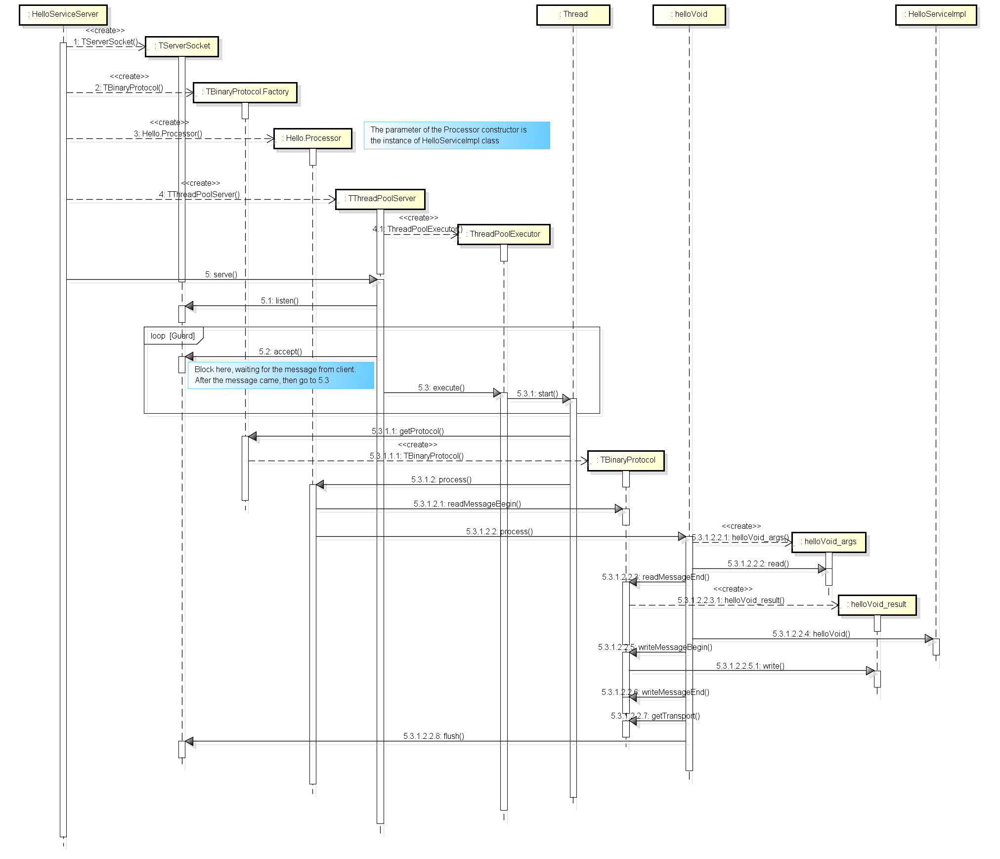
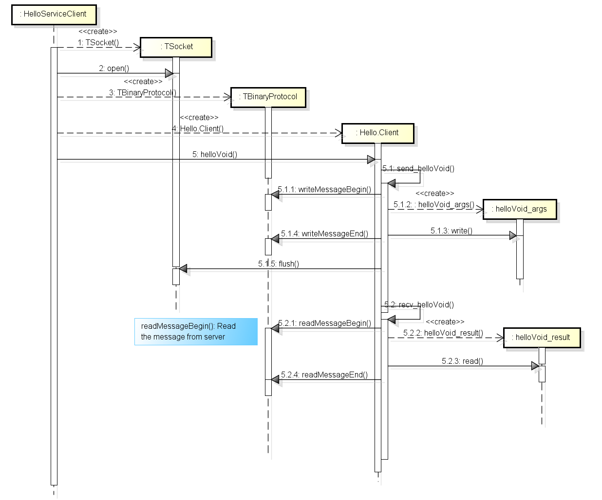
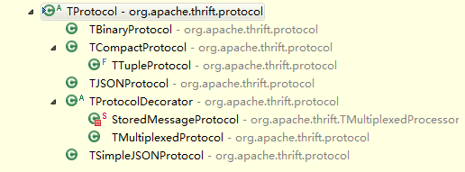

### 微服务架构系列之---初识微服务，为什么说搞定微服务架构，先搞定RPC框架呢  

### 一,什么是微服务  
微服务架构近年来一直都是互联网技术圈的热点，诸如许多新技术如Docker，DevOps，持续交付等背后都有微服务架构的影子。  
微服务作为一种渐进式演进架构，是企业应对复杂业务，支持大规模持续创新等有效的架构手段。其实微服务并不是一个单独兴起的概念，其本质还是在传统的服务架构上进行演进的一个过程，由于微服务架构涉及知识广泛，如SOA概念，微服务通信，容器技术，微服务注册与发现（Dubbo，Zookeeper），分布式缓存，中间件等，所以其学习曲线相对陡峭，其架构落地，网关，监控等技术都是一些常见的挑战。本章就来带大家初步认识一下什么是微服务架构及如何搭建一个简单的微服务架构。  
* 常见业务架构  
    * 单一应用架构：如：数据库访问框架（ORM);
    * 垂直应用架构：如： WEB框架（MVC)；
    * 分布式服务架构： 如：分布式服务框架(RPC)；
    * 流动计算架构（面向服务架构）： 如：资源调度治理中心（SOA）；
* 常见业务架构发展图
    
    微服务概念：  
    * 一组基于业务划分的服务  
    * 独立的进程  
    * 服务间轻量级通讯  
    * 独立技术栈 独立研发 部署  
    * 无集中式管理  
   与单体应用的区别（单体应用特点）：
   * 集中式设计 研发 部署  
   * 资源利用相互影响  
   * 需求迭代与维护成本随应用规模指数提升  
   * 稳定性差  
   * 开发效率低 扩展性低等  
   如何选择：
   小型公司：单应用优先，小公司业务领域不是很清晰，微服务前期投入大，复杂性高。
   大型公司：不用说了，肯定是微服务了。
   发展性公司：单应用优先，随着业务领域逐渐清晰，一步步将单体应用抽离出来转向微服务。  
### 二，什么是RPC  
服务化的好处就是，不限定服务提供方使用的什么技术选型，就能够实现大公司跨团队的技术解耦，如下图：  
  
如上，如果没有统一的服务框架，各个团队的服务提供方都需要各自实现一套序列化，反序列化，网络框架，连接池，收发线程，超时处理，状态机等一些业务之外的重复技术劳动，造成整体工程的低效。随着服务化和微服务化逐渐成为中大型分布式系统架构的主流方式，RPC扮演的角色就渐渐重要起来。所以，统一RPC框架就是服务化所要解决的首要问题。 
什么是RPC，RPC（Remote Procedure Call Protocol），远程过程调用协议。它是一种进程间通信方式，允许通过网络从远程计算机上请求服务，而不需要了解底层网络技术的协议。即程序要无论是调用本地的还是远程的，本质上编写的调用代码基本相同。RPC跨越了传输层和应用层，所以使的开发包括网络分布式多程序应用更加容易。其实就是像调用本地函数一样调用远程函数。  
与常见的HTTP服务不同，RPC主要是基于TCP/IP协议的，所以效率来说RPC当然更胜一筹。 
RPC采用客户机/服务器模式。请求程序是一个客户机，服务提供程序就是一个服务器。首先，客户机调用进程发送一个有进程参数的调用信息到服务进程，然后等待应答信息。在服务器端，进程保持睡眠状态直到调用信息到达为止。当一个调用信息到达，服务器获得进程参数，计算结果，发送答复信息，然后等待下一个调用信息，最后，客户端调用进程接收答复信息，获得进程结果，然后调用执行继续进行。
远程过程调用流程    
  
这里 user 就是 client 端，当 user 想发起一个远程调用时，它实际是通过本地调用user-stub。user-stub 负责将调用的接口、方法和参数通过约定的协议规范进行编码并通过本地的 RPCRuntime 实例传输到远端的实例。远端 RPCRuntime 实例收到请求后交给 server-stub 进行解码后发起本地端调用，调用结果再返回给 user 端。RPC调用分为同步和异步两种。  
更详细的rpc调用流程图  
  
RPC 服务方通过 RpcServer 去导出（export）远程接口方法，而客户方通过 RpcClient 去引入（import）远程接口方法。客户方像调用本地方法一样去调用远程接口方法，RPC 框架提供接口的代理实现，实际的调用将委托给代理RpcProxy 。代理封装调用信息并将调用转交给RpcInvoker 去实际执行。在客户端的RpcInvoker 通过连接器RpcConnector 去维持与服务端的通道RpcChannel，并使用RpcProtocol 执行协议编码（encode）并将编码后的请求消息通过通道发送给服务方。

RPC 服务端接收器 RpcAcceptor 接收客户端的调用请求，同样使用RpcProtocol 执行协议解码（decode）。解码后的调用信息传递给RpcProcessor 去控制处理调用过程，最后再委托调用给RpcInvoker 去实际执行并返回调用结果。

### 三，RPC 组件职责
上面我们进一步拆解了 RPC 实现结构的各个组件组成部分，下面我们详细说明下每个组件的职责划分。
1. RpcServer
   负责导出（export）远程接口
2. RpcClient
   负责导入（import）远程接口的代理实现
3. RpcProxy
   远程接口的代理实现
4. RpcInvoker
   客户方实现：负责编码调用信息和发送调用请求到服务方并等待调用结果返回
   服务方实现：负责调用服务端接口的具体实现并返回调用结果
5. RpcProtocol
   负责协议编/解码
6. RpcConnector
   负责维持客户方和服务方的连接通道和发送数据到服务方
7. RpcAcceptor
   负责接收客户方请求并返回请求结果
8. RpcProcessor
   负责在服务方控制调用过程，包括管理调用线程池、超时时间等
9. RpcChannel
   数据传输通道
### 四，RPC框架核心技术点  
RPC框架实现的几个核心技术点：

（1）服务暴露：

远程提供者需要以某种形式提供服务调用相关的信息，包括但不限于服务接口定义、数据结构、或者中间态的服务定义文件。例如Facebook的Thrift的IDL文件，Web service的WSDL文件；服务的调用者需要通过一定的途径获取远程服务调用相关的信息。

目前，大部分跨语言平台 RPC 框架采用根据 IDL 定义通过 code generator （代码产生器）去生成 stub 代码，这种方式下实际导入的过程就是通过代码生成器在编译期完成的。代码生成的方式对跨语言平台 RPC 框架而言是必然的选择，而对于同一语言平台的 RPC 则可以通过共享接口定义来实现。这里的导入方式本质也是一种代码生成技术，只不过是在运行时生成，比静态编译期的代码生成看起来更简洁些。

java 中还有一种比较特殊的调用就是多态，也就是一个接口可能有多个实现，那么远程调用时到底调用哪个？这个本地调用的语义是通过 jvm 提供的引用多态性隐式实现的，那么对于 RPC 来说跨进程的调用就没法隐式实现了。如果前面DemoService 接口有 2 个实现，那么在导出接口时就需要特殊标记不同的实现需要，那么远程调用时也需要传递该标记才能调用到正确的实现类，这样就解决了多态调用的语义问题。

（2）远程代理对象：

服务调用者用的服务实际是远程服务的本地代理。说白了就是通过动态代理来实现。

java 里至少提供了两种技术来提供动态代码生成，一种是 jdk 动态代理，另外一种是字节码生成。动态代理相比字节码生成使用起来更方便，但动态代理方式在性能上是要逊色于直接的字节码生成的，而字节码生成在代码可读性上要差很多。两者权衡起来，个人认为牺牲一些性能来获得代码可读性和可维护性显得更重要。

（3）通信：

RPC框架与具体的协议无关。RPC 可基于 HTTP 或 TCP 协议，Web Service 就是基于 HTTP 协议的 RPC，它具有良好的跨平台性，但其性能却不如基于 TCP 协议的 RPC。

1. TCP/HTTP：众所周知，TCP 是传输层协议，HTTP 是应用层协议，而传输层较应用层更加底层，在数据传输方面，越底层越快，因此，在一般情况下，TCP 一定比 HTTP 快。

2. 消息ID：RPC 的应用场景实质是一种可靠的请求应答消息流，和 HTTP 类似。因此选择长连接方式的 TCP 协议会更高效，与 HTTP 不同的是在协议层面我们定义了每个消息的唯一 id，因此可以更容易的复用连接。

3. IO方式：为了支持高并发，传统的阻塞式 IO 显然不太合适，因此我们需要异步的 IO，即 NIO。。

4. 多连接：既然使用长连接，那么第一个问题是到底 client 和 server 之间需要多少根连接？实际上单连接和多连接在使用上没有区别，对于数据传输量较小的应用类型，单连接基本足够。单连接和多连接最大的区别在于，每根连接都有自己私有的发送和接收缓冲区，因此大数据量传输时分散在不同的连接缓冲区会得到更好的吞吐效率。所以，如果你的数据传输量不足以让单连接的缓冲区一直处于饱和状态的话，那么使用多连接并不会产生任何明显的提升，反而会增加连接管理的开销。
5. 心跳：连接是由 client 端发起建立并维持。如果 client 和 server 之间是直连的，那么连接一般不会中断（当然物理链路故障除外）。如果 client 和 server 连接经过一些负载中转设备，有可能连接一段时间不活跃时会被这些中间设备中断。为了保持连接有必要定时为每个连接发送心跳数据以维持连接不中断。心跳消息是 RPC 框架库使用的内部消息，在前文协议头结构中也有一个专门的心跳位，就是用来标记心跳消息的，它对业务应用透明。

（4）序列化：

两方面会直接影响 RPC 的性能，一是传输方式，二是序列化。

1. 序列化方式：毕竟是远程通信，需要将对象转化成二进制流进行传输。不同的RPC框架应用的场景不同，在序列化上也会采取不同的技术。 就序列化而言，Java 提供了默认的序列化方式，但在高并发的情况下，这种方式将会带来一些性能上的瓶颈，于是市面上出现了一系列优秀的序列化框架，比如：Protobuf、Kryo、Hessian、Jackson 等，它们可以取代 Java 默认的序列化，从而提供更高效的性能。

2. 编码内容：出于效率考虑，编码的信息越少越好（传输数据少），编码的规则越简单越好（执行效率高）。如下是编码需要具备的信息：  
-- 调用编码 --  
1. 接口方法  
   包括接口名、方法名  
2. 方法参数  
   包括参数类型、参数值  
3. 调用属性  
   包括调用属性信息，例如调用附件隐式参数、调用超时时间等   
-- 返回编码 --  
1. 返回结果  
   接口方法中定义的返回值  
2. 返回码  
   异常返回码  
3. 返回异常信息  
   调用异常信息 
除了以上这些必须的调用信息，我们可能还需要一些元信息以方便程序编解码以及未来可能的扩展。这样我们的编码消息里面就分成了两部分，一部分是元信息、另一部分是调用的必要信息。如果设计一种 RPC 协议消息的话，元信息我们把它放在协议消息头中，而必要信息放在协议消息体中。下面给出一种概念上的 RPC 协议消息设计格式：  
-- 消息头 --  
magic      : 协议魔数，为解码设计  
header size: 协议头长度，为扩展设计  
version    : 协议版本，为兼容设计  
st         : 消息体序列化类型  
hb         : 心跳消息标记，为长连接传输层心跳设计  
ow         : 单向消息标记，  
rp         : 响应消息标记，不置位默认是请求消息  
status code: 响应消息状态码  
reserved   : 为字节对齐保留  
message id : 消息 id  
body size  : 消息体长度  
-- 消息体 --  
采用序列化编码，常见有以下格式  
xml   : 如 webservie soap  
json  : 如 JSON-RPC  
binary: 如 thrift; hession; kryo 等  

### 五,RPC框架Thrift  
#### 5.1.thrift简介  
  RPC的主要功能目标是让构建分布式计算（应用）更容易，在提供强大的远程调用能力时不损失本地调用的语义简洁性。对于多体应用，由于各服务部署在不同机器，服务间的调用免不了网络通信过程，服务消费方每调用一个服务都要写一坨网络通信相关的代码，不仅复杂而且极易出错。如果有一种方式能让我们像调用本地服务一样调用远程服务，而让调用者对网络通信这些细节透明，那么将大大解放程序员的双手，大幅度提高生产力。比如，服务消费方在执行helloService.hi(“Panda”)时，实质上调用的是远端的服务。这种方式其实就是RPC（Remote Procedure Call Protocol），在各大互联网公司中被广泛使用，如阿里巴巴的HSF、Dubbo（开源）、Facebook的Thrift（开源）、Google GRPC（开源）、Twitter的Finagle（开源）等。  

Apache Thrift 最初是 Facebook 实现的一种支持多种编程语言、高效的远程服务器调用框架，它于 2008 年进入 Apache 开源项目。Apache Thrift 采用接口描述语言（IDL）定义 RPC 接口和数据类型，通过编译器生成不同语言的代码（支持 C++，Java，Python，Ruby，Php，Erlang, Perl, Haskell, C#, Cocoa, JavaScript, Node.js, Smalltalk, go等），其数据传输采用二进制格式，相对 XML 和 JSON 来说体积更小，对于高并发、大数据量和多语言的环境更有优势。在 Facebook，Apache Thrift 正是使用于其内部服务的通信，其稳定性和高性能已在生产环境中得到证明。  

#### 5.2.thrift架构  
架构图  
  
服务端时序图  
  
客户端时序图  
  
  
Thrift是一个客户端和服务器端的架构体系，在最上层是用户自行实现的业务逻辑代码。

第二层是由thrift编译器自动生成的代码，主要用于结构化数据的解析，发送和接收。

TServer主要任务是高效的接受客户端请求，并将请求转发给Processor处理。Processor负责对客户端的请求做出响应，包括RPC请求转发，调用参数解析和用户逻辑调用，返回值写回等处理。

从TProtocol以下部分是thirft的传输协议和底层I/O通信。TProtocol是用于数据类型解析的，将结构化数据转化为字节流给TTransport进行传输。

TTransport是与底层数据传输密切相关的传输层，负责以字节流方式接收和发送消息体，不关注是什么数据类型。

底层IO负责实际的数据传输，包括socket、文件和压缩数据流等。
协议层TProtocol：
在传输协议上总体上划分为文本(text)和二进制(binary)传输协议, 为节约带宽，提供传输效率，一般情况下使用二进制类型的传输协议为多数。
   1>TBinaryProtocol – 二进制编码格式进行数据传输。   
   2>TCompactProtocol – 高效的编码方式，使用类似于protobuffer的Variable-Length Quantity (VLQ) 编码(可以节省传输空间，使数据的传输效率更高)对数据进行压缩。 关于VLQ了解更多（http://en.wikipedia.org/wiki/Variable-length_quantity）  
   3>TJSONProtocol – 使用JSON的数据编码协议进行数据传输。   
   4>TSimpleJSONProtocol – 这种节约只提供JSON只写的协议，适用于通过脚本语言解析      
   5>TDebugProtocol – 在开发的过程中帮助开发人员调试用的，以文本的形式展现方便阅读。  

  

- 传输层TTransport  
    1>TSocket- 使用阻塞式I/O进行传输，也是最常见的模式。 
    2>TFramedTransport- 使用非阻塞方式，按块的大小，进行传输，类似于Java中的NIO。  
    3>TFileTransport- 顾名思义按照文件的方式进程传输，虽然这种方式不提供Java的实现，但是实现起来非常简单。 
    4>TMemoryTransport- 使用内存I/O，就好比Java中的ByteArrayOutputStream实现。   
    5>TZlibTransport- 使用执行zlib压缩，不提供Java的实现。  
    6>TNonblockingTransport-使用非阻塞方式，用于构建异步客户端。  
- 服务端类型  
    1>TSimpleServer -  单线程服务器端使用标准的阻塞式I/O。  
    2>TThreadPoolServer -  多线程服务器端使用标准的阻塞式I/O。 
    3>TNonblockingServer – 多线程服务器端使用非阻塞式I/O，并且实现了Java中的NIO通道。  
    
####  5.3.thrift开发示例  
搭建Thrift编译环境：  
Linux下的源码安装，直接wget或手动下载最tar.gz安装包编译安装:
```
    tar -xvf thrift-0.9.1.tar.gz
    cd thrift-0.9.1
    ./configure
    make 
    make install
```
使用命令thrift -version，显示Thrift version 0.9.1 则表示安装成功。
Windows下的Thrift安装直接使用Thrift提供的安装包即可。  

1.编写HelloThrift.thrift  
这个是个标准文本，里面只有一个sayHello 方法。
```
    namespace php HelloThrift
    service HelloService {
        string sayHello(1:string username)
    }
```

通过 thrift -r --gen php:server HelloThrift.thrift 命令会在当前目录下生成一个  gen-php 。为了方便改名为 gen_php 。注意划线。  

2.把 thrift 的 lib文件夹 拷到项目的根下  
3.写服务端  
```
    <?php
    namespace HelloThrift\php;
    
    error_reporting(E_ALL);
    
    require_once __DIR__.'/lib/php/lib/Thrift/ClassLoader/ThriftClassLoader.php';
    use Thrift\ClassLoader\ThriftClassLoader;
    
    $GEN_DIR = realpath(dirname(__FILE__)).'/gen_php';
    $loader = new ThriftClassLoader();
    $loader->registerNamespace('Thrift',__DIR__.'/lib/php/lib');
    $loader->registerDefinition('HelloThrift',$GEN_DIR);
    $loader->register();
    
    if (php_sapi_name() == 'cli') {
        ini_set('display_errors',"stderr");
    }
    
    use Thrift\Protocol\TBinaryProtocol;
    use Thrift\Transport\TPhpStream;
    use Thrift\Transport\TBufferedTransport;
    
    class HelloHandler implements \HelloThrift\HelloServiceIf {
    
        public function sayHello($username)
        {
            return "Hello ".$username;
        }
    }
    
    header('Content-Type','application/x-thrift');
    if (php_sapi_name() == 'cli') {
        echo PHP_EOL;
    }
    
    $handler = new HelloHandler();
    $processor = new \HelloThrift\HelloServiceProcessor($handler);
    
    $transport = new TBufferedTransport(new TPhpStream(TPhpStream::MODE_R | TPhpStream::MODE_W));
    $protocol = new TBinaryProtocol($transport,true,true);
    
    $transport->open();
    $processor->process($protocol,$protocol);
    $transport->close();
```  
服务器的只有一个sayHello 方法。在require 时注意一下文件路径。  

4.写客户端。Client.php  

```
    <?php
    namespace  HelloThrift\php;
    
    error_reporting(E_ALL);
    require_once __DIR__.'/lib/php/lib/Thrift/ClassLoader/ThriftClassLoader.php';
    use Thrift\ClassLoader\ThriftClassLoader;
    
    $GEN_DIR = realpath(dirname(__FILE__)).'/gen_php';
    $loader = new ThriftClassLoader();
    $loader->registerNamespace('Thrift',__DIR__.'/lib/php/lib');
    $loader->registerDefinition('HelloThrift',$GEN_DIR);
    $loader->register();
    
    use Thrift\Protocol\TBinaryProtocol;
    use Thrift\Transport\TSocket;
    use Thrift\Transport\THttpClient;
    use Thrift\Transport\TBufferedTransport;
    use Thrift\Exception\TException;
    
    try {
        if (array_search('--http',$argv)) {
            $socket = new THttpClient('localhost',8080,'/Server.php');
        } else {
            $socket = new TSocket('localhost',9090);
        }
    
        $transport = new TBufferedTransport($socket,1024,1024);
        $protocol  = new TBinaryProtocol($transport);
        $client = new \HelloThrift\HelloServiceClient($protocol);
    
        $transport->open();
    
        echo $client->sayHello(" World! ");
    
        $transport->close();
    } catch (\Exception $e) {
        print 'TException:'.$e->getMessage().PHP_EOL;
    }
```  
5.运行服务。在项目的根下运行命令  php -S localhost:8080  
6.运行客户端进行测试。直接使用 php Client --http 命令。可以看到 Hello World! 成功。  

参考：
https://blog.csdn.net/mindfloating/article/details/39473807
https://blog.csdn.net/mindfloating/article/details/39474123
https://blog.csdn.net/zdyueguanyun/article/details/60870551

