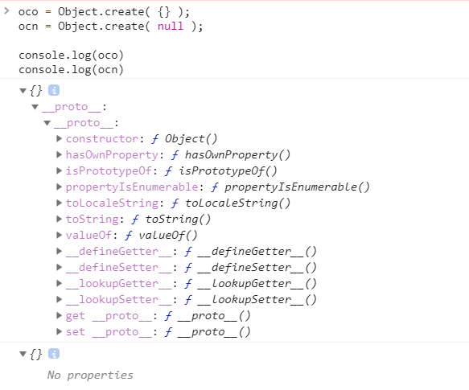

## 分享内容：
```
Object.create();
```

### 方法释义：
    `Object.create()`方法会使用指定的原型对象及其属性创建一个新的对象。

### 语法：
```
    bject.create(proto,descriptors)
```

- proto : 新创建对象的原型对象。
- descriptors : 可选，没有指定为undefined。js对象。功能等同于`Object.defineProperties()`.

### 返回值：
    具有指定原型对象和属性的新对象。


### 示例：
```
    function Shape() {
    this.x = 0;
    this.y = 0;
    }

    Shape.prototype.move = function(x, y) {
    this.x += x;
    this.y += y;
    console.info('Shape moved.');
    };

    function Rectangle() {
    Shape.call(this); 
    }

    Rectangle.prototype = Object.create(Shape.prototype);
    Rectangle.prototype.constructor = Rectangle;

    var rect = new Rectangle();

    console.log('Is rect an instance of Rectangle?',
    rect instanceof Rectangle); // true
    console.log('Is rect an instance of Shape?',
    rect instanceof Shape); // true
    rect.move(1, 1); // Outputs, 'Shape moved.'
```


### 特殊情况：
    
    以null为原型创建对象，会得到一个干净的对象。

```
    oco = Object.create( {} );  
    ocn = Object.create( null ); 

    console.log(oco) 
    console.log(ocn) 
```



### 兼容处理
```
    if (typeof Object.create !== "function") {
        Object.create = function (proto, propertiesObject) {
            if (!(proto === null || typeof proto === "object" || typeof proto === "function")) {
                throw TypeError('Argument must be an object, or null');
            }
            var temp = new Object();
            temp.__proto__ = proto;
            if(typeof propertiesObject ==="object")
                Object.defineProperties(temp,propertiesObject);
            return temp;
        };
    }
```